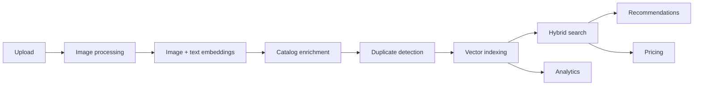

# Multi-Modal Product Intelligence Engine

> A production-grade AI backend for ingesting, understanding, and searching product
> catalogs across **text and images** — combining multi-modal embeddings, vector search,
> automated metadata enrichment, duplicate detection, pricing intelligence, explainability,
> and an opt-in enterprise layer behind a FastAPI service.

<p>
  <a href="https://github.com/Vikas9892/product_intelligence/actions/workflows/ci.yml"></a>
  
  
  
  
  
  
  
</p>

This is a monorepo. The application lives in [`backend/`](backend/) and is documented in
depth there — start with **[backend/README.md](backend/README.md)**.

---

## What it does

Upload a product (an image plus metadata); the platform standardizes the image, generates
image and text embeddings, enriches the catalog entry, checks for duplicates, indexes it
for search, and serves intelligence over it — search, recommendations, price estimates,
and per-decision explanations. Heavy work runs on a background worker pool, so uploads
return immediately.



### Capabilities

| Area | Summary |
|---|---|
| **Multi-modal embeddings** | CLIP image vectors (512-d) + BGE text vectors (384-d) |
| **Hybrid search** | Weighted fusion of image and text similarity, with optional cross-encoder reranking |
| **Recommendations** | Retrieval + multi-signal scoring + brand-diversity filtering |
| **Duplicate detection** | Weighted-similarity decision (`OFF`/`WARN`/`BLOCK`) + optional explainable cross-encoder verifier |
| **Pricing intelligence** | Deterministic estimation from comparables (trimmed mean / weighted average / median) |
| **Explainability** | Structured decision traces for recommendations, duplicates, and rankings |
| **Analytics** | REST reporting over Redis daily buckets |
| **Observability** | Prometheus metrics, health/readiness probes, structured logging |
| **Enterprise (opt-in)** | API keys, RBAC, tenant isolation, audit logging, usage quotas |

> [!NOTE]
> Metadata enrichment is performed by local attribute/tag extraction — there are **no
> external LLM calls**. The OpenAI keys present in configuration are reserved shape only.

---

## Repository layout

```
.
├── backend/                  # FastAPI service + worker pool (see backend/README.md)
├── .github/workflows/ci.yml  # GitHub Actions: ruff, black --check, mypy, pytest
├── .pre-commit-config.yaml   # Repo-wide git hooks (ruff, black, mypy, hygiene)
├── .editorconfig             # Repo-wide editor formatting rules
├── Makefile                  # make install / run / lint / format / typecheck / test / clean
├── storage/                  # Runtime image artifacts (uploads / processed)
└── README.md                 # You are here
```

`backend/` is the only application component today. A frontend and deployment/infra
tooling are planned future additions and would arrive as sibling directories at this level
without disturbing `backend/`.

---

## Getting started

Prerequisites: **Python 3.12**, [`uv`](https://docs.astral.sh/uv/), and — to run the full
stack — **Redis** and **Qdrant**. From the repo root:

```bash
make install    # uv sync + pre-commit install
make run        # uvicorn app.main:app --reload  (http://localhost:8000/docs)
make lint       # ruff check
make format     # ruff format + black
make typecheck  # mypy
make test       # pytest with coverage
```

The async upload pipeline also needs the worker process:

```bash
uv run --directory backend python scripts/run_workers.py
```

See **[backend/README.md](backend/README.md)** for full setup, configuration, and the
end-to-end demo.

---

## Documentation

| Document | Purpose |
|---|---|
| [backend/README.md](backend/README.md) | Backend overview, features, quickstart |
| [backend/ARCHITECTURE.md](backend/ARCHITECTURE.md) | Deep technical design and diagrams |
| [backend/DEPLOYMENT.md](backend/DEPLOYMENT.md) | Configuration, runtime, and deployment notes |
| [backend/DEMO.md](backend/DEMO.md) | End-to-end walkthrough |
| [backend/CHANGELOG.md](backend/CHANGELOG.md) | Version history by phase |
| [backend/CONTRIBUTING.md](backend/CONTRIBUTING.md) | Contribution workflow and standards |

---

## Status

The backend is **feature-complete** across its build phases (multi-modal ingestion,
search, recommendations, duplicate detection, pricing, explainability, analytics, and the
opt-in enterprise layer). Quality is enforced by a CI workflow and a local pre-commit gate.

| | |
|---|---|
| Tests | **1327 passing** |
| Branch coverage | **99%** |
| Quality gate | ruff · black · mypy · pytest (CI + pre-commit) |
| Persistence | Qdrant (vectors) · Redis (queue/state/cache/analytics/enterprise) · filesystem |

### Planned

- **Frontend** — a client application (not yet in the repository).
- **Production deployment** — containerization (Docker), orchestration (Kubernetes),
  infrastructure-as-code (Terraform), and cloud (AWS). See
  [backend/DEPLOYMENT.md](backend/DEPLOYMENT.md), where each is marked *Planned — not
  implemented*.

---

## License

License **to be determined** — no license file is currently included in the repository.
Until one is added, all rights are reserved by the authors.
