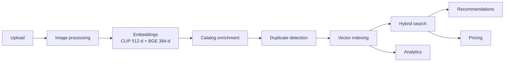
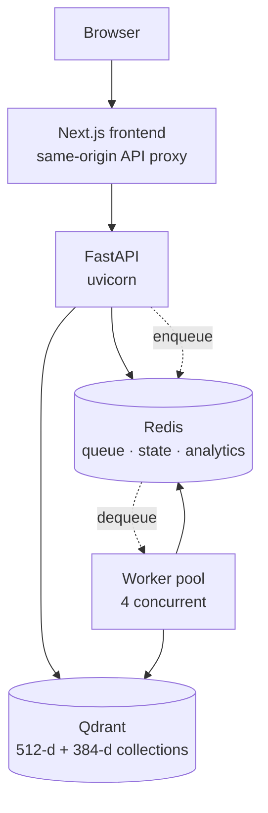

# Multi-Modal Product Intelligence Engine

> Upload a product photo and its details. The platform embeds the image **and** the text,
> enriches the catalog entry, detects duplicates, indexes it for hybrid search, and then
> explains every decision it made — search relevance, recommendations, duplicate verdicts
> and price estimates — through a typed REST API and a Next.js console.

<p>
  <a href="https://github.com/Vikas9892/product_intelligence/actions/workflows/ci.yml"></a>
  
  
  
  
  
  
  
  
  
</p>

---

## 📹 Video walkthrough

**▶ [Watch the demo](https://youtu.be/VIphj8Worjw)** — a walkthrough of the running system.

[](https://youtu.be/VIphj8Worjw)

If you would rather run it yourself, it is one command — see
[Try it in one command](#try-it-in-one-command).

---

## Contents

- [What it does](#what-it-does)
- [Capabilities](#capabilities)
- [Try it in one command](#try-it-in-one-command)
- [Engineering highlights](#engineering-highlights) ← _the interesting part_
- [Architecture](#architecture)
- [Repository layout](#repository-layout)
- [Getting started](#getting-started)
- [Testing and quality](#testing-and-quality)
- [Documentation](#documentation)
- [Status](#status)

---

## What it does

A product enters as an image plus metadata. Everything after that is automatic, and the
heavy work happens on a background worker pool so the upload returns immediately with a
job to poll.



The distinguishing idea is **explainability**. Every intelligence feature returns a
structured decision trace, not just a number: which signals matched, what each contributed,
and what the weighted sum came to. A price estimate names the comparables it used _and the
ones it excluded_. A duplicate verdict shows its four similarity signals. A recommendation
shows all four score components and the arithmetic that produced the final figure.

> [!NOTE]
> Enrichment runs **entirely locally** — CLIP, BGE and an optional cross-encoder, with
> CPU-only PyTorch. There are **no external LLM calls** and no per-request API costs. The
> OpenAI keys in configuration are reserved shape only.

---

## Capabilities

| Area                       | What it does                                                                                                                             |
| -------------------------- | ---------------------------------------------------------------------------------------------------------------------------------------- |
| **Multi-modal embeddings** | CLIP image vectors (512-d) + BGE text vectors (384-d), generated locally                                                                 |
| **Hybrid search**          | Weighted fusion of image and text similarity, text-only, image-only, or both — with metadata facets and optional cross-encoder reranking |
| **Recommendations**        | Retrieval + four-signal scoring (similarity, attributes, tags, quality) + brand-diversity filtering                                      |
| **Duplicate detection**    | Weighted-similarity verdict (`OFF`/`WARN`/`BLOCK`) with a four-signal breakdown, plus an optional cross-encoder verifier                 |
| **Pricing intelligence**   | Deterministic estimation from same-category comparables, with IQR outlier removal — and an honest refusal when the evidence is too thin  |
| **Explainability**         | Structured decision traces with per-component weights that **add up to the final score**                                                 |
| **Catalog enrichment**     | Colour, material, style and tags extracted from the image and text; a quality score per product                                          |
| **Analytics**              | REST reporting over Redis daily buckets                                                                                                  |
| **Observability**          | Prometheus metrics, liveness/readiness probes, dependency health, structured logging                                                     |
| **Enterprise (opt-in)**    | API keys, RBAC, tenant isolation, audit logging, usage quotas — off by default                                                           |

**29 REST endpoints.** Interactive docs at `/docs` once running.

---

## Try it in one command

Prerequisites: **Git**, **Docker**, **Python 3**. Nothing else — no Node, Redis, Qdrant or
PyTorch on your machine.

```bash
git clone https://github.com/Vikas9892/product_intelligence.git
cd product_intelligence
python scripts/demo.py
```

That starts five containers, waits for health, seeds a 25-product catalog through the
**real upload API**, waits for the pipeline, runs **30 verification checks**, and prints
where to look:

```
ALL CHECKS PASSED  30 checks in 5.9s

Demo environment ready.

  Frontend    http://localhost:3000
  API docs    http://localhost:8000/docs
```

> [!IMPORTANT]
> **Budget 10–15 minutes for the first run.** The build installs PyTorch and compiles the
> Next.js bundle, and the first upload downloads CLIP (~600 MB) and BGE (~130 MB) once into
> a named volume. Measured afterwards: a full seed-and-verify takes **~66 s**; re-verifying
> an already-seeded catalog takes **~6 s**.

Ports are configurable — `FRONTEND_PORT=3100 python scripts/demo.py` if 3000 is taken.

---

## Engineering highlights

The parts worth asking about. Each is a real decision with evidence behind it, not a
framework default.

### The image is 2.06 GB, not 7 GB

On Linux, PyPI's `torch` declares hard dependencies on the entire CUDA runtime — cuDNN,
NCCL, Triton, cuBLAS at 423 MB alone — roughly **5–7 GB** of GPU libraries that a CPU-only
container can never reach. It never surfaced in development because the Windows wheel is
122 MB and pulls no NVIDIA packages at all; only a Linux build hits it.

`pyproject.toml` pins torch to PyTorch's CPU index behind a `sys_platform == 'linux'`
marker, so Windows and macOS development resolves from PyPI exactly as before while Docker
and CI get the `+cpu` build. → [ADR-001](docs/aws/ADR-001-compute.md)

### One image, two roles

The same backend image runs the API and the worker, selected by the container command.
Both need an identical dependency closure, so two images would mean downloading PyTorch
twice and keeping two artifacts in sync. It also maps cleanly onto one ECR image backing
two ECS services later. → [DOCKER.md](DOCKER.md)

### Colour was reading the background, not the product

Dominant-colour extraction averaged the **whole frame**, so on studio-white product
photography the backdrop won. Measured across the demo catalog before the fix: a black
shoe, a red mug, a blue shoe and a black backpack **all** returned `(238, 240, 244)` and
were tagged `white` and `bright`.

Fixed by estimating the backdrop from the image border and computing statistics over the
remaining subject pixels. That exposed a second bug underneath: nearest-neighbour colour
naming in raw RGB put a genuine blue closer to _grey_ than to _blue_, because achromatic
entries sit in the middle of the RGB cube. Naming now works in HLS and judges hue
separately from lightness.

### Pricing refuses rather than guessing

Comparable selection originally filtered on one condition: the price is positive. A running
shoe was therefore priced partly from a **desk lamp**, and a ₹24.50 mug was valued at
₹91.57 by averaging it against footwear.

The instinctive fix — a similarity floor — **does not work**, and measurement is what shows
it: cross-category items score 0.68–0.80 while a legitimate same-category comparable scores
0.86. No threshold separates them. Category compatibility is the real signal, so it does
the primary work and the floor guards thin evidence within a category.

When nothing relevant survives, the API returns `status: "no_estimate"` with a **null**
price — never `0.0`, which reads as a valuation of zero — and the UI renders an em dash
with the reason. → [Why pricing and recommendations differ](docs/aws/ARCHITECTURE.md#why-pricing-and-recommendations-enforce-category-differently)

### The explainability panel's arithmetic closes

The recommendation trace published two of four score components, both at a hardcoded weight
of `1.0`. A real response read "similarity 0.57, quality 0.64" against a final of **0.51** —
a total below both displayed contributions, with 35% of the score invisible.

The formula was correct; the explanation was not. All four components are now published at
their configured weights, read from settings so the published breakdown cannot drift from
the formula that produced the score, and the UI shows the aggregation step:

```
Similarity      0.57 × 0.55 = 0.3135
Attribute match 0.40 × 0.20 = 0.0800
Tag match       0.35 × 0.15 = 0.0525
Quality         0.64 × 0.10 = 0.0640
                Sum          0.5100
                Final score  0.5100
```

### One normaliser, called from both sides

Filtered search returned zero results, always. Ingest slugified category (`"Men shoes"` →
`"men-shoes"`) and merely trimmed brand (`"Nike"` stayed `"Nike"`); the query path passed
the raw user string into Qdrant's exact, case-sensitive `MatchValue`.

Proven by querying Qdrant directly, bypassing the application: `category="men-shoes"`
matched 5 points, `category="Men shoes"` matched 0. Fixed with a **single** `normalize_facet`
imported by both paths — adding a second normaliser on the query side would have reproduced
the original failure in a new place.

### Tests that verify the deployment, not the code

A standard-library-only smoke suite (`scripts/smoke/`) talks to the platform over **HTTP
only** — never Redis, Qdrant, Docker or the filesystem — so the same runner verifies a local
Compose stack today and an AWS deployment later:

```bash
python scripts/smoke/runner.py --base-url https://api.example.com
```

It seeds a deterministic catalog with **known relationships** and asserts semantic
invariants rather than brittle scores: an image must match itself at ≥0.95, a near-twin must
outrank a desk lamp, a product must not recommend itself. Exit codes are CI-ready.

It also found a **real production bug** the unit tests could not: a transient Redis error
killed all four worker loops permanently and silently — 33 hours of a `running` container
consuming nothing, with zero log output — because the dequeue sat outside the only
try/except and `asyncio` never surfaces an unretrieved task exception.

---

## Architecture

Five services, one private Docker network. Redis and Qdrant are never published to the
host in the production-like profile.



**Redis is the system of record, not a cache.** It holds products, job state, the
dead-letter queue, analytics buckets and tenant data — there is no relational database.
That inverts the usual "losing a cache is cheap" assumption and is why persistence is
enabled and backups matter.

A full AWS production design — ECS Fargate, S3, ElastiCache, ALB, VPC — is written up as
five ADRs with a costed analysis in [docs/aws/](docs/aws/). **Design only; nothing is
deployed.**

---

## Repository layout

```
.
├── backend/                  # FastAPI service + worker pool (~17.6k LOC)
│   └── Dockerfile            # One image, two roles: API and worker
├── frontend/                 # Next.js 15 console (App Router, TanStack Query)
│   └── Dockerfile            # Standalone production build
├── docker-compose.yml        # Shared base: all five services
├── docker-compose.dev.yml    # Dev overlay: mounted source, hot reload
├── docker-compose.prod.yml   # Production-like: immutable images, no mounts
├── scripts/demo.py           # One command: start + seed + verify
├── scripts/seed_catalog.py   # 25-product coherent demo catalog
├── scripts/smoke/            # Deployment-agnostic smoke tests (HTTP only)
├── docs/aws/                 # AWS architecture design + 5 ADRs + cost analysis
├── DOCKER.md                 # Container reference
├── .github/workflows/ci.yml  # CI: backend + frontend gates
└── Makefile                  # Thin wrappers; scripts run directly too
```

---

## Getting started

### Everything in Docker

```bash
python scripts/demo.py        # or: make demo
```

| Command                 | What it does                                                   |
| ----------------------- | -------------------------------------------------------------- |
| `make demo`             | Start, seed and verify everything                              |
| `make smoke`            | Verify a running deployment (`SMOKE_BASE_URL` targets another) |
| `make catalog`          | Show the demo catalog and why each product exists              |
| `make up-prod`          | Production-like: immutable images, no source mounts            |
| `make up-dev`           | Development: source mounted, hot reload on both servers        |
| `make ps` / `make logs` | Status and health / tail all services                          |
| `make down`             | Stop everything (data preserved)                               |
| `make reset`            | **DESTRUCTIVE**: delete all data, including uploads and models |

Every `make` target is a thin wrapper — the scripts are the implementation and run directly,
so GNU make is never required (this matters on Windows).

### Backend on the host

Prerequisites: **Python 3.12**, [`uv`](https://docs.astral.sh/uv/), Docker for the two
backing services.

```bash
make install       # uv sync + pre-commit install
make services-up   # Qdrant + Redis only
make run           # uvicorn --reload  → http://localhost:8000/docs
make worker        # in a second terminal; required for async uploads
```

---

## Testing and quality

|                   |                                                                            |
| ----------------- | -------------------------------------------------------------------------- |
| **Backend**       | **1424 tests**, 99% branch coverage                                        |
| **Frontend**      | **171 unit tests** (Vitest + Testing Library), **12 Playwright E2E specs** |
| **Deployment**    | **30 smoke checks** over HTTP, runnable against any environment            |
| **Gates**         | ruff · black · mypy `--strict` · pytest — in CI _and_ pre-commit           |
| **Accessibility** | jest-axe assertions and a Lighthouse release gate                          |

```bash
make lint && make typecheck && make test    # backend
cd frontend && npm run check                # lint + format + types + tests
```

CI runs both stacks on every push. `uv sync --locked` and `npm ci` fail the build if a
lockfile has drifted, rather than silently resolving something nobody reviewed.

---

## Documentation

| Document                                           | Purpose                                                          |
| -------------------------------------------------- | ---------------------------------------------------------------- |
| [backend/DEMO.md](backend/DEMO.md)                 | One-command demo, the demo catalog, and a `curl` API walkthrough |
| [DOCKER.md](DOCKER.md)                             | Container reference: images, profiles, volumes, troubleshooting  |
| [docs/aws/](docs/aws/)                             | AWS production architecture, 5 ADRs, security and cost analysis  |
| [backend/README.md](backend/README.md)             | Backend overview, configuration, quickstart                      |
| [backend/ARCHITECTURE.md](backend/ARCHITECTURE.md) | Deep technical design and diagrams                               |
| [backend/DEPLOYMENT.md](backend/DEPLOYMENT.md)     | Configuration, runtime, deployment notes                         |
| [frontend/README.md](frontend/README.md)           | Frontend architecture, the API proxy, design decisions           |
| [backend/CHANGELOG.md](backend/CHANGELOG.md)       | Version history by phase                                         |

---

## Status

| Area                        | State                                                                                                            |
| --------------------------- | ---------------------------------------------------------------------------------------------------------------- |
| **Backend**                 | Complete — ingestion, search, recommendations, duplicates, pricing, explainability, analytics, opt-in enterprise |
| **Frontend**                | Complete — 10 pages, accessibility-hardened, release-gated                                                       |
| **Containerization**        | Complete — five services, dev/prod profiles, one-command demo                                                    |
| **Deployment verification** | Complete — deployment-agnostic smoke suite                                                                       |
| **AWS architecture**        | **Designed, not deployed** — ADRs and cost analysis in [docs/aws/](docs/aws/)                                    |
| **Infrastructure-as-code**  | Not started — Terraform is the next stage                                                                        |

### Honest limitations

Worth stating plainly rather than discovering later:

- **Nothing is deployed to AWS.** The architecture is designed and costed; no resources
  exist and no Terraform is written.
- **The enterprise layer is off by default**, so a default deployment is unauthenticated
  and single-tenant. It must be enabled before exposing real data.
- **Re-indexing is required** after upgrades that add payload fields (canonical facet keys,
  image references). `make reset && python scripts/seed_catalog.py`.
- **Images are synthetic.** The demo catalog is drawn programmatically — deterministic,
  dependency-free, and free of any licensing question — not scraped product photography.

---

## License

License **to be determined** — no license file is currently included. Until one is added,
all rights are reserved by the author.
