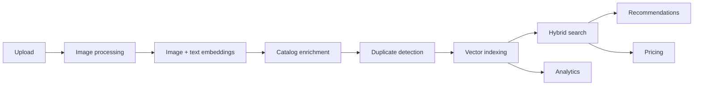

# Multi-Modal Product Intelligence Engine

> A production-grade AI backend for ingesting, understanding, and searching product
> catalogs across **text and images** — combining multi-modal embeddings, vector search,
> automated metadata enrichment, duplicate detection, pricing intelligence, explainability,
> and an opt-in enterprise layer behind a FastAPI service.

<p>
  <a href="https://github.com/Vikas9892/product_intelligence/actions/workflows/ci.yml"></a>
  
  
  
  
  
  
  
</p>

This is a monorepo. The application lives in [`backend/`](backend/) and is documented in
depth there — start with **[backend/README.md](backend/README.md)**.

---

## What it does

Upload a product (an image plus metadata); the platform standardizes the image, generates
image and text embeddings, enriches the catalog entry, checks for duplicates, indexes it
for search, and serves intelligence over it — search, recommendations, price estimates,
and per-decision explanations. Heavy work runs on a background worker pool, so uploads
return immediately.



### Capabilities

| Area | Summary |
|---|---|
| **Multi-modal embeddings** | CLIP image vectors (512-d) + BGE text vectors (384-d) |
| **Hybrid search** | Weighted fusion of image and text similarity, with optional cross-encoder reranking |
| **Recommendations** | Retrieval + multi-signal scoring + brand-diversity filtering |
| **Duplicate detection** | Weighted-similarity decision (`OFF`/`WARN`/`BLOCK`) + optional explainable cross-encoder verifier |
| **Pricing intelligence** | Deterministic estimation from comparables (trimmed mean / weighted average / median) |
| **Explainability** | Structured decision traces for recommendations, duplicates, and rankings |
| **Analytics** | REST reporting over Redis daily buckets |
| **Observability** | Prometheus metrics, health/readiness probes, structured logging |
| **Enterprise (opt-in)** | API keys, RBAC, tenant isolation, audit logging, usage quotas |

> [!NOTE]
> Metadata enrichment is performed by local attribute/tag extraction — there are **no
> external LLM calls**. The OpenAI keys present in configuration are reserved shape only.

---

## Repository layout

```
.
├── backend/                  # FastAPI service + worker pool (see backend/README.md)
│   └── Dockerfile            # One image, two roles: API and worker
├── frontend/                 # Next.js 15 web client (see frontend/README.md)
│   └── Dockerfile            # Standalone production build
├── docker-compose.yml        # Shared base: all five services
├── docker-compose.dev.yml    # Dev overlay: mounted source, hot reload
├── docker-compose.prod.yml   # Production-like overlay: immutable images
├── DOCKER.md                 # Container reference
├── scripts/demo.py           # One command: start + seed + verify
├── scripts/smoke/            # Deployment-agnostic smoke tests (HTTP only)
├── .github/workflows/ci.yml  # GitHub Actions: backend + frontend gates
├── .pre-commit-config.yaml   # Repo-wide git hooks (ruff, black, mypy, hygiene)
├── .editorconfig             # Repo-wide editor formatting rules
├── Makefile                  # make demo / smoke / up-prod / install / run / test
├── storage/                  # Runtime image artifacts (uploads / processed)
└── README.md                 # You are here
```

`docker-compose.yml` is the shared base and is not meant to be run alone — combine it with
one of the two overlays (see [DOCKER.md](DOCKER.md)). Host-based development is still
fully supported: `make services-up` starts only Qdrant and Redis, leaving the API, worker
and frontend to run on the host with reloading and the Hugging Face cache as normal.

---

## Getting started

### Run everything in Docker (recommended)

Prerequisites: **Git**, **Docker**, and **Python 3** (to run the demo script). Nothing
else — no Node, Redis or Qdrant on the host. From the repo root:

```bash
python scripts/demo.py
```

That starts the whole stack, seeds a deterministic demo catalog through the real upload
API, verifies 30 behaviors end to end, and tells you where to look:

```
Demo environment ready.

  Frontend    http://localhost:3000
  API docs    http://localhost:8000/docs
```

`make demo` is the same thing. To start the stack without seeding or verifying:

```bash
docker compose -f docker-compose.yml -f docker-compose.prod.yml up -d --build   # or: make up-prod
```

> [!IMPORTANT]
> **Budget 10–15 minutes for the first run.** The initial build installs PyTorch and
> builds the Next.js bundle, and the first *upload* downloads CLIP (~600 MB) and BGE
> (~130 MB) into the `model_cache` volume. That happens once and survives
> `docker compose down`. Afterwards a full seed-and-verify takes ~66 s, and re-verifying
> an already-seeded catalog ~6 s.

| Command | What it does |
|---|---|
| `make demo` | Start, seed and verify everything (wraps `python scripts/demo.py`) |
| `make smoke` | Verify a running deployment; `SMOKE_BASE_URL` targets another one |
| `make catalog` | Show the demo catalog and why each product exists |
| `make up-prod` | Production-like: immutable images, no source mounts |
| `make up-dev` | Development: source mounted, hot reload on both servers |
| `make ps` | Status and health of all five services |
| `make logs` | Tail logs from every service |
| `make down` | Stop everything (data is preserved) |
| `make reset` | **DESTRUCTIVE**: stop and delete all data, including uploads and models |

Every `make` target here is a thin wrapper — the scripts are the implementation and run
directly (`python scripts/demo.py`), so GNU make is never required.

Ports are configurable if something already occupies them —
`FRONTEND_PORT=3100 make up-prod`. See **[DOCKER.md](DOCKER.md)** for the full reference.

### Run the backend on the host

Prerequisites: **Python 3.12**, [`uv`](https://docs.astral.sh/uv/), and **Docker** (which
provides the two backing services — Redis and Qdrant — so you don't have to install them
natively). From the repo root:

```bash
make install       # uv sync + pre-commit install
make services-up   # start Qdrant + Redis, wait until both are healthy
make run           # uvicorn app.main:app --reload  (http://localhost:8000/docs)
```

The async upload pipeline also needs the worker process, in a second terminal:

```bash
make worker        # uv run python scripts/run_workers.py
```

**Backing services** — `docker-compose.yml` runs Qdrant (`:6333` REST, `:6334` gRPC) and
Redis (`:6379`), matching the defaults in `backend/.env.example`, so an empty
`backend/.env` works against them unchanged. Data lives in named Docker volumes and
survives `services-down`.

```bash
make services-status  # health of both services
make services-logs    # tail their logs
make services-down    # stop them (data is preserved)
make services-reset   # DESTRUCTIVE: stop and delete all vector/Redis data
```

> [!IMPORTANT]
> Redis is **not** just a queue here — it is the platform's primary datastore (job state,
> cache, analytics buckets, enterprise data). The compose file therefore enables AOF
> persistence. `make services-reset` erases that data along with the vectors.

**Quality gates:**

```bash
make lint       # ruff check
make format     # ruff format + black
make typecheck  # mypy
make test       # pytest with coverage
```

See **[backend/README.md](backend/README.md)** for full setup, configuration, and the
end-to-end demo.

---

## Documentation

| Document | Purpose |
|---|---|
| [DOCKER.md](DOCKER.md) | Running the full stack in containers |
| [backend/DEMO.md](backend/DEMO.md) | One-command demo, demo catalog, and API walkthrough |
| [backend/README.md](backend/README.md) | Backend overview, features, quickstart |
| [backend/ARCHITECTURE.md](backend/ARCHITECTURE.md) | Deep technical design and diagrams |
| [backend/DEPLOYMENT.md](backend/DEPLOYMENT.md) | Configuration, runtime, and deployment notes |
| [backend/CHANGELOG.md](backend/CHANGELOG.md) | Version history by phase |
| [backend/CONTRIBUTING.md](backend/CONTRIBUTING.md) | Contribution workflow and standards |

---

## Status

The backend is **feature-complete** across its build phases (multi-modal ingestion,
search, recommendations, duplicate detection, pricing, explainability, analytics, and the
opt-in enterprise layer). Quality is enforced by a CI workflow and a local pre-commit gate.

| | |
|---|---|
| Tests | **1327 passing** |
| Branch coverage | **99%** |
| Quality gate | ruff · black · mypy · pytest (CI + pre-commit) |
| Persistence | Qdrant (vectors) · Redis (queue/state/cache/analytics/enterprise) · filesystem |

### Planned

- **Frontend** — a client application (not yet in the repository).
- **Production deployment** — containerization (Docker), orchestration (Kubernetes),
  infrastructure-as-code (Terraform), and cloud (AWS). See
  [backend/DEPLOYMENT.md](backend/DEPLOYMENT.md), where each is marked *Planned — not
  implemented*.

---

## License

License **to be determined** — no license file is currently included in the repository.
Until one is added, all rights are reserved by the authors.
