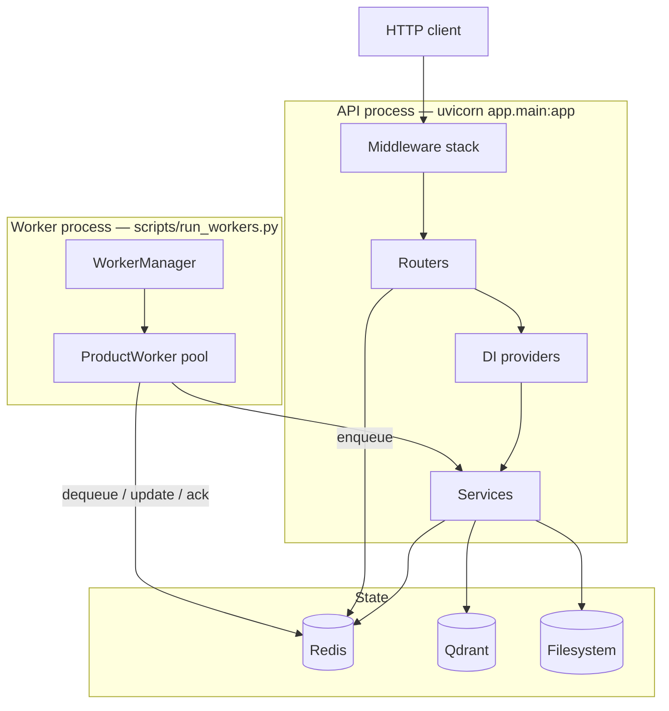
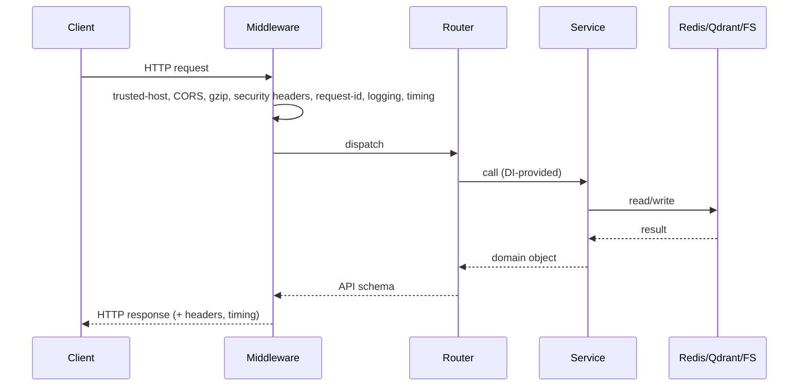
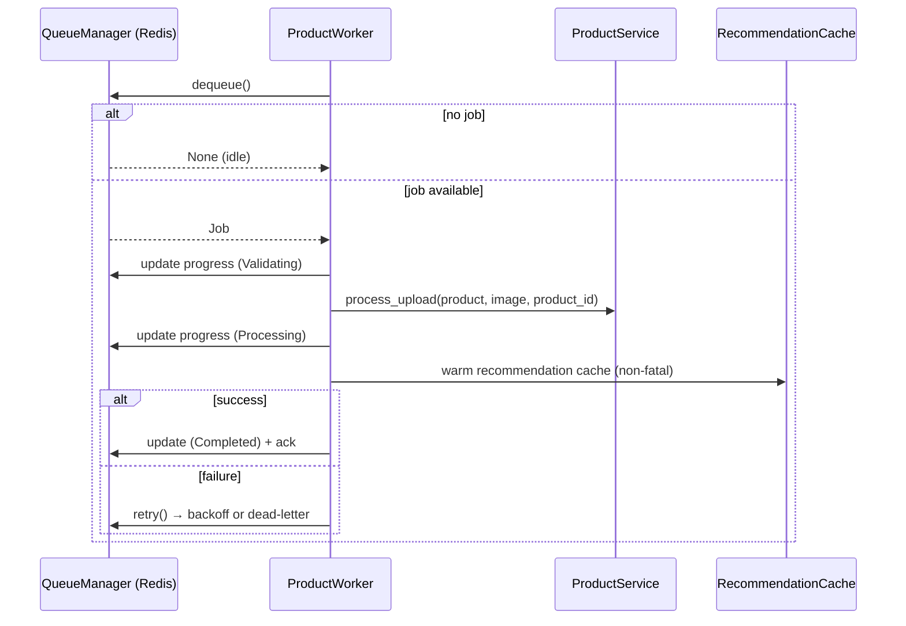
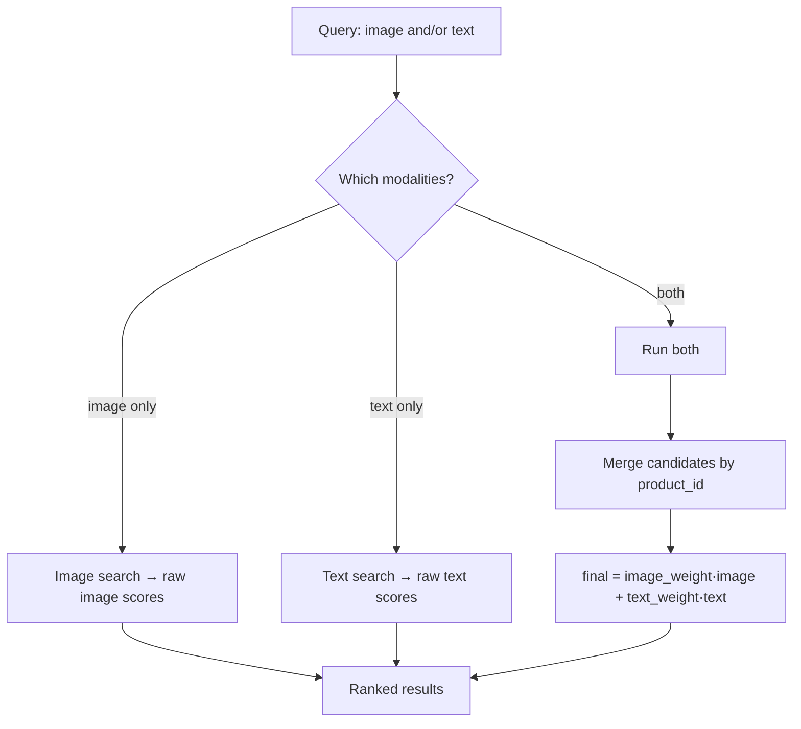
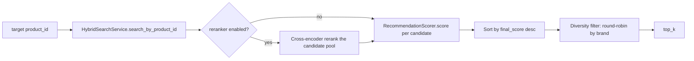
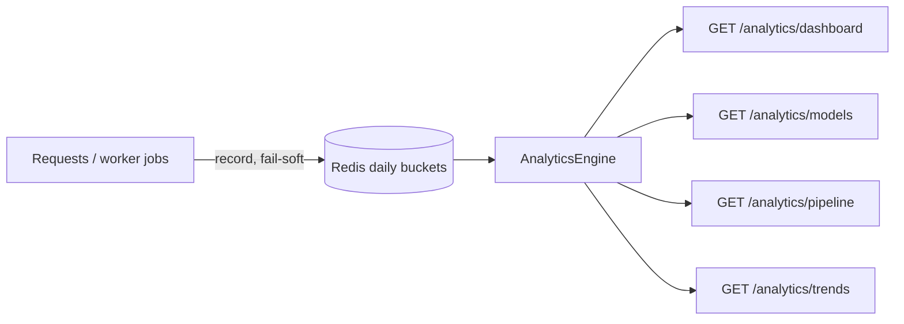
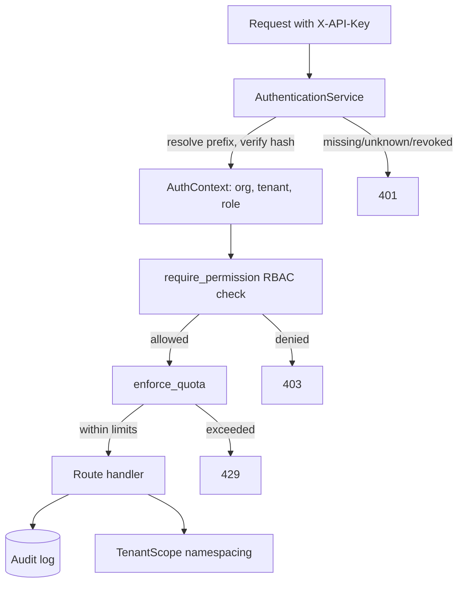

# Architecture

This document describes the technical design of the Product Intelligence Platform backend: its layering, request and worker pipelines, retrieval and ranking flows, the enterprise layer, observability, and the responsibilities of each service and folder.

> Everything here reflects the current implementation. Components that do not exist in the repository (containerization, orchestration, cloud, relational database) are **not** described as if they do — see [DEPLOYMENT.md](./DEPLOYMENT.md) for those planned placeholders. Continuous integration (GitHub Actions) is in place and is covered in DEPLOYMENT.md.

---

## Table of contents

- [Design principles](#design-principles)
- [System architecture](#system-architecture)
- [Folder responsibilities](#folder-responsibilities)
- [Configuration and dependency injection](#configuration-and-dependency-injection)
- [Request flow](#request-flow)
- [Worker pipeline](#worker-pipeline)
- [Retrieval pipeline (hybrid search)](#retrieval-pipeline-hybrid-search)
- [Recommendation pipeline](#recommendation-pipeline)
- [Duplicate detection and verification](#duplicate-detection-and-verification)
- [Pricing engine](#pricing-engine)
- [Explainability](#explainability)
- [Analytics](#analytics)
- [Model registry](#model-registry)
- [Enterprise layer](#enterprise-layer)
- [Caching](#caching)
- [Observability](#observability)
- [Persistence model](#persistence-model)

---

## Design principles

| Principle | How it shows up |
|---|---|
| **Clean layering** | Routers → services → repositories/vector-store/queue. Routers hold no business logic. |
| **Dependency injection** | Every collaborator is constructor-injected; DI providers in `app/dependencies/` supply cached singletons. |
| **Domain vs. API separation** | `app/models/` holds domain models; `app/schemas/` holds API request/response schemas with `from_*` mappers. |
| **Feature flags** | Optional domains (pricing, analytics, enterprise, reranker, duplicate verification, health endpoints, metrics) are gated by settings and only wire up when enabled. |
| **Backward compatibility** | New phases add opt-in layers; existing services are not rewritten. |
| **Determinism where possible** | Pricing and scoring are deterministic; only embeddings/rerankers are model-driven. |
| **Fully typed** | Strict mypy across the codebase. |

---

## System architecture



The application is constructed exactly once by `create_app()` (`app/application.py`), which wires middleware, exception handlers, routers, and metrics. `app/main.py` exposes `app = create_app()` for Uvicorn. Startup/shutdown lives in `app/lifespan.py` (currently: ensure runtime directories exist, log lifecycle).

### Middleware order

`add_middleware` prepends, so the **last** call is outermost. The resulting runtime order (outermost → innermost) is:

```
TrustedHost → CORS → GZip → SecurityHeaders → RequestID → RequestLogging → Timing → routing
```

- **TrustedHost** rejects forged `Host` headers cheaply, first.
- **CORS** wraps every response (including error responses).
- **GZip** compresses the inner stack's output.
- **SecurityHeaders** stamps headers on every response.
- **RequestID** must precede **RequestLogging** (the id must exist before the "request started" line).
- **RequestLogging** must wrap **Timing** so it can read the measured duration.

---

## Folder responsibilities

| Folder | Responsibility |
|---|---|
| `app/api/` | One thin router per domain. Parses/validates input, calls a service, shapes a schema. No business logic. |
| `app/services/` | All business logic. Sub-packages: `embeddings/`, `vectorstore/`, `duplicate/`, `recommendation/`, `pricing/`, `analytics/`, `explanations/`, `evaluation/`, `enterprise/`, `catalog/`. |
| `app/models/` | Pydantic domain models (the internal language of the system). |
| `app/schemas/` | Pydantic API schemas; keep the wire contract decoupled from domain models. |
| `app/repositories/` | Redis-backed persistence: analytics buckets, API keys, audit log, organizations/tenants, quotas, recommendation cache. |
| `app/queue/` | `BaseQueue` abstraction, `RedisQueue` implementation, `QueueManager` (retry/backoff/dead-letter policy). |
| `app/jobs/` | Job domain types: `Job`, `JobResult`, `JobStatus`, `JobType`. |
| `app/workers/` | `ProductWorker` (processes one job), `WorkerManager` (runs the concurrent pool). |
| `app/metrics/` | `MetricsRegistry` (idempotent Prometheus collectors) and metric-name constants. |
| `app/middleware/` | request-id, structured logging, timing, security headers. |
| `app/dependencies/` | DI providers (`@lru_cache` cached singletons) plus auth/RBAC/quota dependencies. |
| `app/core/` | `settings.py` (validated config schema), `config.py` (singleton), `constants.py`, `logging.py`, `paths.py`. |
| `app/exceptions/` | Typed exception hierarchy and global handlers that map them to HTTP responses. |
| `app/utils/`, `app/validators/` | Pure helpers (image/text/metadata) and input validators. |
| `scripts/` | Operational entry points outside the `app` package: `run_workers.py`, `benchmark.py`. |
| `tests/` | 159 files mirroring the package structure. |
| `evaluation/`, `storage/`, `reports/`, `logs/` | Retrieval dataset, image artifacts, benchmark output, runtime logs. |

---

## Configuration and dependency injection

Configuration is a nested Pydantic-Settings tree in `app/core/settings.py`, loaded once as a singleton in `app/core/config.py`. Environment variables use `__` nesting (e.g. `HYBRID_SEARCH__IMAGE_WEIGHT`). Production applies stricter validation — for example, startup fails if the secret key or trusted hosts are left at insecure defaults.

DI providers in `app/dependencies/` construct services lazily and cache them (`@lru_cache(maxsize=1)`), so a single instance is reused per process. Routes depend on these providers rather than constructing services themselves, which keeps routers thin and makes every collaborator swappable in tests.

---

## Request flow



Errors raised anywhere inside are caught by the global handlers registered in `app/exceptions/handlers.py` and mapped to consistent JSON error responses — and, because the handlers run inside the middleware stack, error responses still receive CORS/security headers and timing.

---

## Worker pipeline

The worker pool is a **separate OS process** (`scripts/run_workers.py`), never started by Uvicorn. `WorkerManager` runs `WORKER_CONCURRENCY` concurrent `ProductWorker` loops; each processes one job at a time. Shutdown is graceful on SIGINT/SIGTERM: in-flight jobs finish (or fail through to a scheduled retry) before exit.



**Idempotency.** A job carries a fixed `product_id`; every vector write is a Qdrant upsert keyed by that id, so a retried job converges to the same state instead of creating duplicate points.

**Retry / dead-letter.** `QueueManager.retry` owns backoff and the dead-letter decision (`MAX_RETRIES`, `RETRY_DELAY_SECONDS`). Exhausted jobs land in a dead-letter list exposed via `GET /jobs/dead-letter`.

`ProductService.process_upload` is called as **one opaque step** rather than six worker-visible stages, so the worker never reaches into the service's private sub-services — progress is reported at a handful of coarse checkpoints.

---

## Retrieval pipeline (hybrid search)

`HybridSearchService` composes an image-only `SearchService` and a text-only `TextSearchService`, plus its own fusion logic. Behavior depends on which modalities the query provides:



- Default fusion weights: `image_weight = 0.7`, `text_weight = 0.3`.
- A candidate present on only one side contributes zero for the missing side.
- Single-modality queries return their raw, unweighted scores (an image-only search should reflect image similarity directly).

### Cross-encoder reranking (optional)

When `RERANKER__ENABLED=true`, `RerankerService` re-scores the top-N candidates with a cross-encoder (`CrossEncoderService`), which feeds query and document to the model *together* for a more accurate — but slower — relevance judgment. `ModelManagerCrossEncoder` handles lazy, locked loading; inference runs off the event loop. This is the classic **overfetch-then-rerank** shape, and the same reranker is reused by recommendations, duplicate verification, and pricing.

---

## Recommendation pipeline



`RecommendationEngineService` is a thin orchestrator; all signal math lives in `RecommendationScorer`. Default score weights: similarity `0.55`, attribute `0.20`, tag `0.15`, catalog-quality `0.10`. The brand-diversity filter avoids returning many items from the same brand in a row. When the cross-encoder is enabled, the overfetched pool is reranked *before* the scorer runs, and each candidate's similarity signal becomes its cross-encoder score.

---

## Duplicate detection and verification

Two distinct, coexisting mechanisms:

| | `DuplicateDetectionService` (upload-time) | `DuplicateVerificationService` (on demand) |
|---|---|---|
| **Used by** | `POST /products/upload` | `POST /products/check-duplicate` |
| **Method** | Weighted similarity across image/text/metadata/attribute signals | Hybrid retrieval → cross-encoder → business rules |
| **Output** | A single `DuplicateDecision` | An explainable `DuplicateVerification` with separated signals and human-readable reasons |
| **Default** | Always runs (mode-driven) | Opt-in (`DUPLICATE_VERIFICATION__ENABLED`) |

Upload-time detection has three modes: `OFF` (skips detection, attaches a neutral decision), `WARN` (stores the product and attaches the decision), and `BLOCK` (raises `409 Conflict` before persistence when a likely duplicate is found). Detection runs **before** normalization and vector indexing so a blocked upload never becomes searchable.

---

## Pricing engine


`PricingEngine` reuses the existing retrieval pipeline rather than building a new one. It is **deterministic end to end** — no ML in the aggregation, no randomness. Strategies: `trimmed_mean` (default), `weighted_average`, `median`. IQR (Tukey-fence) outlier removal precedes aggregation, and confidence is capped at "low" when there are too few comparables (`MIN_COMPARABLES`). The described-product path reuses the cross-encoder; the by-product-id path uses retrieval order alone (price aggregation is insensitive to exact ordering).

---

## Explainability

`ExplanationService` is a facade over per-subject explainers — `HybridSearchExplainer`, `RerankExplainer`, `DuplicateExplainer`, `RecommendationExplainer` — behind one typed interface, so routes depend only on the facade. It produces structured traces (`GET /recommendations/{id}/trace`, `/duplicates/{id}/trace`, `/products/{id}/explanations`) and records explanation metrics (latency, count, average confidence, decision-type distribution).

---

## Analytics

`AnalyticsEngine` is a pure reader over the per-day counters that `AnalyticsRepository` records in Redis (plus the model registry). It never records events and never runs a model. It produces windowed usage metrics, a dashboard snapshot, pipeline aggregates, and labeled trend reports. Recording is **fail-soft** — analytics must never break the request it is counting.



---

## Model registry

`ModelRegistry` is pure metadata bookkeeping: it tracks which model version is active per `ModelType` (image / text / reranker) and validates configured model names at startup. It **never loads a model** — loading stays with the model managers. Embedding and reranker services resolve their default model name through the registry rather than reading settings directly, giving a single source of truth. Exposed read-only via `GET /models`, `/models/{type}`, `/models/{type}/active`.

---

## Enterprise layer

Opt-in and off by default (`ENTERPRISE__ENABLED=false`). When enabled, the enterprise router mounts and its dependencies enforce authentication, RBAC, and quotas.



- **Authentication** — API keys are `pik_` tokens; only a SHA-256 hash is stored. Lookup is by prefix, verification is constant-time (`hmac.compare_digest`). Missing/unknown/revoked/tampered keys → `401`.
- **RBAC** — `Role` and `Permission` enums with cumulative frozensets (`viewer ⊆ member ⊆ admin ⊆ owner`). `require_permission(...)` is a dependency factory returning `403` on failure. Key creation forbids privilege escalation (the new key's permissions must be a subset of the caller's).
- **Organizations / tenants** — stored in Redis. `POST /organizations` is the single open bootstrap endpoint (creates org + default tenant + initial owner key, returned once); in production it belongs behind a platform-admin gate.
- **Tenant isolation** — `TenantScope` namespaces Qdrant collections and Redis keys as `{prefix}_{tenant_id}_{base}`, providing isolation as a mechanism without threading tenant ids through every pre-existing service.
- **Audit logging** — `AuditRepository` appends events (LPUSH + LTRIM, capped per tenant). Exposed via `GET /audit`.
- **Quotas** — `QuotaRepository` maintains per-tenant daily and per-minute counters (with TTLs). Enforcement is **fail-closed**; a configured limit of `0` disables that quota.

---

## Caching

- **Recommendation cache** — `RecommendationCacheRepository` (Redis, TTL `RECOMMENDATION__CACHE_TTL_SECONDS`). The worker warms it after processing an upload; the live endpoint still works on a cache miss (warm-up failure is non-fatal).
- **Model caching** — model managers load each model once and reuse it for the process lifetime.
- **DI singletons** — service instances are cached per process via `@lru_cache`.

---

## Observability

- **Logging** — structured logs via `app/core/logging.py` (optional JSON). Payloads and embeddings are never logged — only ids, stages, and counts.
- **Request context** — request-id and timing middleware annotate every request/response.
- **Metrics** — `MetricsRegistry` registers idempotent Prometheus collectors under a configurable namespace. Tracked series include upload/embedding/rerank/pricing/explanation latency, queue depth, worker jobs (running/total/dead-letter), and duplicate/recommendation/pricing/explanation counters. `prometheus-fastapi-instrumentator` adds standard HTTP series and exposes `GET /metrics`.
- **Health** — unversioned `GET /health`, `/ready`, `/version` (always on) plus operational `GET /system/health`, `/system/stats` (flag-gated).

---

## Persistence model

There is **no relational database**. State lives in three places:

| Store | Holds |
|---|---|
| **Qdrant** | Two cosine collections — `product_images` (512-d) and `product_text` (384-d), auto-created on first use |
| **Redis** | Job queue + job state + dead-letter, analytics daily buckets, enterprise data (orgs, tenants, API keys, audit, quotas), recommendation cache |
| **Filesystem** | `storage/uploads/` (originals) and `storage/processed/` (standardized images) |

`DATABASE__URL` appears in configuration as reserved shape for a possible future phase but is not read by any code path; `ProductService.process_upload` performs no database write.
