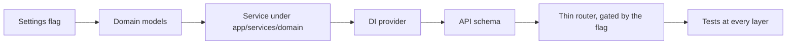

# Contributing

Thanks for your interest in improving the Product Intelligence Platform. This guide
describes how to set up the project, the standards every change must meet, and the
workflow for getting a change merged.

---

## Table of contents

- [Ground rules](#ground-rules)
- [Development setup](#development-setup)
- [Project conventions](#project-conventions)
- [The quality gate](#the-quality-gate)
- [Testing standards](#testing-standards)
- [Commit and branch conventions](#commit-and-branch-conventions)
- [Pull request checklist](#pull-request-checklist)
- [Adding a new feature](#adding-a-new-feature)
- [Reporting issues](#reporting-issues)

---

## Ground rules

- **Preserve the architecture.** Routers stay thin; logic lives in services; persistence
  stays behind repositories, the vector-store abstraction, and the queue abstraction.
- **Stay backward compatible.** Prefer additive, opt-in changes (feature-flagged) over
  rewrites of existing behavior.
- **Everything is typed.** New code must pass strict `mypy`.
- **Tests are not optional.** New behavior ships with tests; coverage should not regress.
- **Document intent.** Match the codebase's existing docstring depth — explain *why*, not
  just *what*.

---

## Development setup

Prerequisites: Python 3.12 and [`uv`](https://docs.astral.sh/uv/).

```bash
cd backend
uv sync                       # install dependencies (incl. dev group)
cp .env.example .env          # sensible defaults; edit only what you need
uv run pre-commit install     # enable the local hooks
```

To exercise the full stack locally you also need **Redis** and **Qdrant** running (see
[README](./README.md#running-locally)). Most tests do **not** require them — Redis is
faked with `fakeredis`.

---

## Project conventions

| Area | Convention |
|---|---|
| **Imports** | Absolute imports only (relative imports are banned by ruff). |
| **Domain vs. API** | Domain models in `app/models/`, wire schemas in `app/schemas/` with `from_*` mappers. |
| **Dependency injection** | Add a provider in `app/dependencies/`; inject collaborators via constructors. |
| **New services** | Place under the appropriate `app/services/<domain>/` package; keep one responsibility per class. |
| **Optional features** | Gate with a setting in `app/core/settings.py` and only mount the router when enabled. |
| **Config** | Nested `pydantic-settings`; expose new options in `.env.example` with a comment. |
| **Metrics** | Add metric names to `app/metrics/metric_names.py`; register via `MetricsRegistry`. |
| **Logging** | Never log payloads, secrets, or embeddings — only ids, stages, and counts. |
| **Persistence** | Redis + Qdrant + filesystem only. Do not introduce a relational database without a design discussion. |

---

## The quality gate

Every change must pass all four checks. They run as pre-commit hooks and must also pass
when run explicitly:

```bash
uv run ruff check .        # lint + import sorting
uv run black --check .     # formatting
uv run mypy .              # static type check
uv run pytest              # full test suite with coverage
```

> [!IMPORTANT]
> Do not bypass pre-commit hooks. If a hook reformats files, re-stage and re-commit.
> A GitHub Actions workflow (`.github/workflows/ci.yml`) runs this same gate on every push
> and pull request to `main`, so keeping it green locally keeps CI green.

---

## Testing standards

- Tests live in `tests/`, mirroring the package layout (e.g. `tests/services/pricing/`).
- Use `pytest` with `pytest-asyncio` (auto mode) for async code.
- Use `fakeredis` for anything Redis-backed; do not require a live Redis in unit tests.
- Prefer dependency injection to patching — construct the unit with fakes/stubs.
- Cover the meaningful branches, not just the happy path. Coverage is measured with
  branch coverage enabled; new code should not lower the project's 99%.
- Keep tests deterministic. Avoid timing-sensitive assertions.

Run a focused subset while developing:

```bash
uv run pytest tests/services/pricing -q
```

---

## Commit and branch conventions

- Work on a feature branch, not `main`.
- Use clear, conventional commit subjects: `feat:`, `fix:`, `test:`, `docs:`, `refactor:`,
  `chore:`.
- Keep commits focused; a commit should leave the gate green.

---

## Pull request checklist

Before opening a PR, confirm:

- [ ] `ruff`, `black`, `mypy`, and `pytest` all pass locally.
- [ ] New behavior is covered by tests; coverage did not regress.
- [ ] Public behavior changes are backward compatible (or gated behind a flag).
- [ ] New configuration is reflected in `.env.example` and, if relevant, the docs.
- [ ] Docstrings explain intent and trade-offs, matching the surrounding code.
- [ ] Relevant documentation (`README`, `ARCHITECTURE`, `DEPLOYMENT`, `CHANGELOG`) is updated.
- [ ] No secrets, payloads, or embeddings are logged.

---

## Adding a new feature

A typical additive feature touches these layers, in order:



1. Add a settings group/flag in `app/core/settings.py` and document it in `.env.example`.
2. Model the domain in `app/models/`.
3. Implement the logic in a new `app/services/<domain>/` class with injected collaborators.
4. Expose a DI provider in `app/dependencies/`.
5. Add request/response schemas in `app/schemas/`.
6. Add a thin router in `app/api/`, and register it in `app/application.py` behind the flag.
7. Add metrics if the feature warrants them.
8. Write tests mirroring each new module, and update the changelog.

---

## Reporting issues

When filing an issue, include: what you expected, what happened, steps to reproduce, and
relevant configuration (redact secrets). For behavior involving models, note whether the
cross-encoder or duplicate verifier was enabled, since both are off by default.
