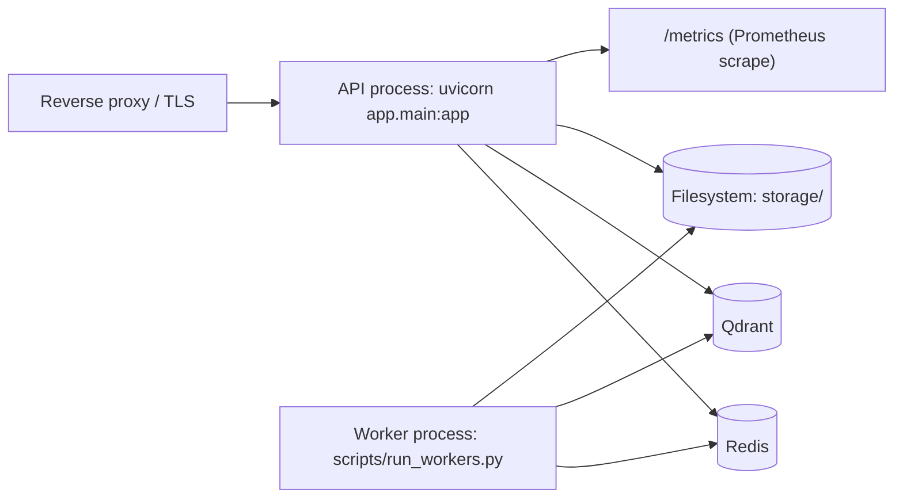
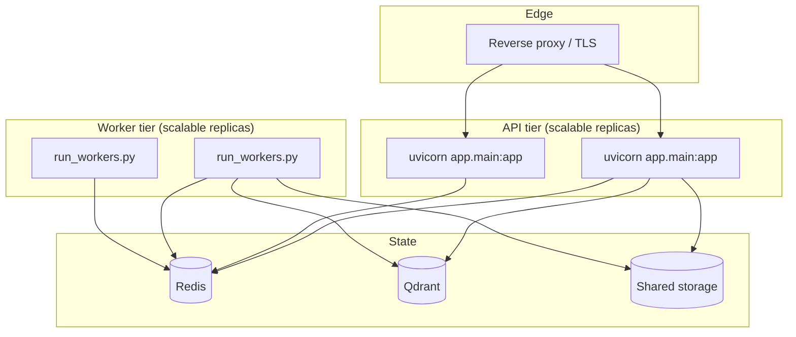

# Deployment

This document covers how to configure and run the Product Intelligence Platform backend, and what production concerns are — and are **not** — yet implemented in the repository.

> [!IMPORTANT]
> The repository currently ships the **application and its worker process only**. There is no Dockerfile, no CI/CD workflow, no Kubernetes/Terraform, no relational database, and no cloud/AWS configuration in the repo. Sections describing those are explicitly marked **Planned — not implemented** and act as placeholders for the production-deployment phase.

---

## Table of contents

- [Runtime topology](#runtime-topology)
- [Prerequisites](#prerequisites)
- [Configuration](#configuration)
- [Environment variables](#environment-variables)
- [Redis](#redis)
- [Qdrant](#qdrant)
- [Running the API](#running-the-api)
- [Running the workers](#running-the-workers)
- [Production configuration checklist](#production-configuration-checklist)
- [Observability in production](#observability-in-production)
- [Planned — Docker](#planned--docker)
- [Planned — relational database](#planned--relational-database)
- [Planned — CI/CD (GitHub Actions)](#planned--cicd-github-actions)
- [Planned — infrastructure and cloud](#planned--infrastructure-and-cloud)
- [Deployment strategy (target)](#deployment-strategy-target)

---

## Runtime topology

Two processes, backed by two external services and the local filesystem:



- The **API process** serves HTTP and enqueues jobs.
- The **worker process** consumes jobs and runs the heavy pipeline.
- Both must share the **same Redis, Qdrant, and storage** to function together.

---

## Prerequisites

| Requirement | Notes |
|---|---|
| Python 3.12 | `>=3.12,<3.13` |
| `uv` | Dependency and virtualenv management |
| Redis | Async pipeline, state, cache, analytics, enterprise data |
| Qdrant | Vector search (image + text collections) |
| Outbound access to Hugging Face | First-time model download (CLIP, BGE, optional cross-encoder) |

---

## Configuration

Configuration is a validated, nested Pydantic-Settings tree (`app/core/settings.py`) loaded once as a singleton (`app/core/config.py`). Copy the template and override only what you need:

```bash
cp .env.example .env
```

Nested keys use a double underscore: `APPLICATION__PORT`, `HYBRID_SEARCH__IMAGE_WEIGHT`, `ENTERPRISE__ENABLED`, etc. Every value in `.env.example` equals its built-in default, so an empty `.env` is a valid local configuration.

---

## Environment variables

Key groups (see `.env.example` for the complete, commented list):

| Group | Purpose | Notable keys |
|---|---|---|
| `APPLICATION__` | App identity, networking, host/CORS policy | `PORT`, `API_PREFIX`, `TRUSTED_HOSTS`, `CORS_ALLOWED_ORIGINS`, `ENVIRONMENT` |
| `AI_MODELS__` | Embedding models and devices | `CLIP_MODEL_NAME`, `TEXT_MODEL_NAME`, `EMBEDDING_DEVICE`, `TEXT_DEVICE` |
| `VECTOR_STORE__` | Qdrant connection and collections | `URL`, `IMAGE_COLLECTION_NAME`, `TEXT_COLLECTION_NAME`, vector sizes |
| `HYBRID_SEARCH__` | Fusion weights | `IMAGE_WEIGHT`, `TEXT_WEIGHT` |
| `RERANKER__` | Cross-encoder reranking (opt-in) | `ENABLED`, `MODEL_NAME`, `TOP_N` |
| `DUPLICATE_DETECTION__` | Upload-time duplicate mode | `MODE` (`off`/`warn`/`block`), `THRESHOLD`, weights |
| `DUPLICATE_VERIFICATION__` | On-demand verifier (opt-in) | `ENABLED`, thresholds, weights |
| `RECOMMENDATION__` | Recommendation scoring and cache | weights, `CACHE_TTL_SECONDS` |
| `PRICING__` | Deterministic pricing | `STRATEGY`, `TOP_K`, `TRIM_RATIO`, `MIN_COMPARABLES` |
| `ANALYTICS__` | REST analytics | `ENABLED`, `WINDOW_DAYS` |
| `ASYNC_PIPELINE__` | Queue and workers | `ENABLED`, `REDIS_URL`, `QUEUE_NAME`, `WORKER_CONCURRENCY`, `MAX_RETRIES` |
| `ENTERPRISE__` | Multi-tenancy (opt-in) | `ENABLED`, `API_KEY_HEADER`, `DAILY_REQUEST_QUOTA`, `RATE_LIMIT_PER_MINUTE` |
| `METRICS__` | Observability | `ENABLED`, `PROMETHEUS_ENABLED`, `HEALTH_ENDPOINTS_ENABLED`, `NAMESPACE` |
| `STORAGE__` | Upload artifacts and limits | `UPLOAD_DIR`, `PROCESSED_DIR`, `MAX_UPLOAD_SIZE_MB`, image guards |
| `SECURITY__` | Secret key and token settings | `SECRET_KEY`, `ALGORITHM`, token expiry |
| `LOGGING__` | Log level and format | `LEVEL`, `JSON_LOGS` |

---

## Redis

Redis is the backbone of the async pipeline and stateful features:

- Job queue, job state, and dead-letter list
- Analytics daily buckets
- Enterprise data (organizations, tenants, API keys, audit log, quotas)
- Recommendation cache

Default connection: `redis://localhost:6379/0` (`ASYNC_PIPELINE__REDIS_URL`). Point this at your managed/hosted Redis in production, and ensure the API and worker processes use the **same** instance.

---

## Qdrant

Qdrant stores two cosine-distance collections, auto-created on first use:

| Collection | Vector size | Source model |
|---|---|---|
| `product_images` | 512 | CLIP |
| `product_text` | 384 | BGE |

Default connection: `http://localhost:6333` (`VECTOR_STORE__URL`). The vector sizes must match the configured models' output dimensions.

> [!NOTE]
> With the enterprise layer enabled, `TenantScope` namespaces collections per tenant (`{prefix}_{tenant_id}_{collection}`).

---

## Running the API

```bash
uv sync
uv run uvicorn app.main:app --host 0.0.0.0 --port 8000
```

For production, run Uvicorn behind a reverse proxy that terminates TLS, and scale by running multiple API workers/replicas (all sharing Redis and Qdrant).

---

## Running the workers

The worker pool is a **separate process** and must be running for async uploads to complete:

```bash
uv run python scripts/run_workers.py
```

- Concurrency is `ASYNC_PIPELINE__WORKER_CONCURRENCY`.
- Shutdown is graceful on SIGINT/SIGTERM (in-flight jobs finish or fall through to a retry).
- Scale throughput by running additional worker processes against the same queue.

> [!TIP]
> For a Redis-free local run, set `ASYNC_PIPELINE__ENABLED=false` to process uploads synchronously. This is a development convenience, not a production mode.

---

## Production configuration checklist

The settings layer enforces several of these at startup when `APPLICATION__ENVIRONMENT=production`:

- [ ] `SECURITY__SECRET_KEY` set to a generated value (startup fails on the insecure default).
- [ ] `APPLICATION__TRUSTED_HOSTS` restricted (not `["*"]`).
- [ ] `APPLICATION__CORS_ALLOWED_ORIGINS` set to your actual frontends.
- [ ] `APPLICATION__DEBUG=false`.
- [ ] Redis and Qdrant pointed at durable, secured instances.
- [ ] `ENTERPRISE__ENABLED=true` (if multi-tenant) with sensible quotas.
- [ ] `RERANKER__ENABLED` / `DUPLICATE_VERIFICATION__ENABLED` decided against the added per-request latency.
- [ ] `METRICS__PROMETHEUS_ENABLED=true` and `/metrics` scraped.
- [ ] `LOGGING__JSON_LOGS=true` for machine-readable logs.

---

## Observability in production

- Scrape `GET /metrics` with Prometheus (namespace `METRICS__NAMESPACE`).
- Use `GET /health` and `GET /ready` as liveness/readiness probes.
- Use `GET /system/health` and `GET /system/stats` for an operational snapshot (flag-gated).

---

## Planned — Docker

> **Status: not implemented.** No `Dockerfile` or Compose file exists in the repository.

Target shape once added:

- A backend image running `uvicorn app.main:app`.
- A worker image (or the same image with a different command) running `scripts/run_workers.py`.
- A Compose file wiring backend + worker + Redis + Qdrant for local parity.

_Placeholder — add container build and Compose instructions here when implemented._

---

## Planned — relational database

> **Status: not implemented.** The system uses Qdrant + Redis + filesystem only.

A `DATABASE__URL` exists in configuration as reserved shape but is not used by any code path. If a relational store (e.g. Postgres) is introduced in a future phase, document its schema, migrations, and connection management here.

_Placeholder — no database deployment steps apply today._

---

## Planned — CI/CD (GitHub Actions)

> **Status: not implemented.** There is no `.github/workflows/` directory.

The quality gate currently runs **locally** and via pre-commit hooks:

```bash
uv run ruff check .
uv run black --check .
uv run mypy .
uv run pytest
```

Target CI once added: run the gate above on every push/PR and block merges on failure.

_Placeholder — add workflow files and badges here when implemented._

---

## Planned — infrastructure and cloud

> **Status: not implemented.** No Kubernetes manifests, Terraform, or AWS configuration exist in the repository.

Target scope for the production-deployment phase:

- Kubernetes manifests / Helm for the API and worker deployments.
- Terraform for Redis, Qdrant, and networking.
- A cloud (e.g. AWS) environment and a hosted demo.

_Placeholder — no cloud deployment exists yet; do not reference environment URLs until one is provisioned._

---

## Deployment strategy (target)



The API and worker tiers scale independently against shared Redis/Qdrant/storage. The containerization, orchestration, and cloud pieces required to run this topology as a managed deployment are the subject of the planned production phase above.
