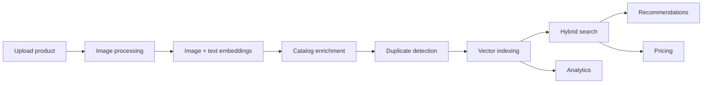
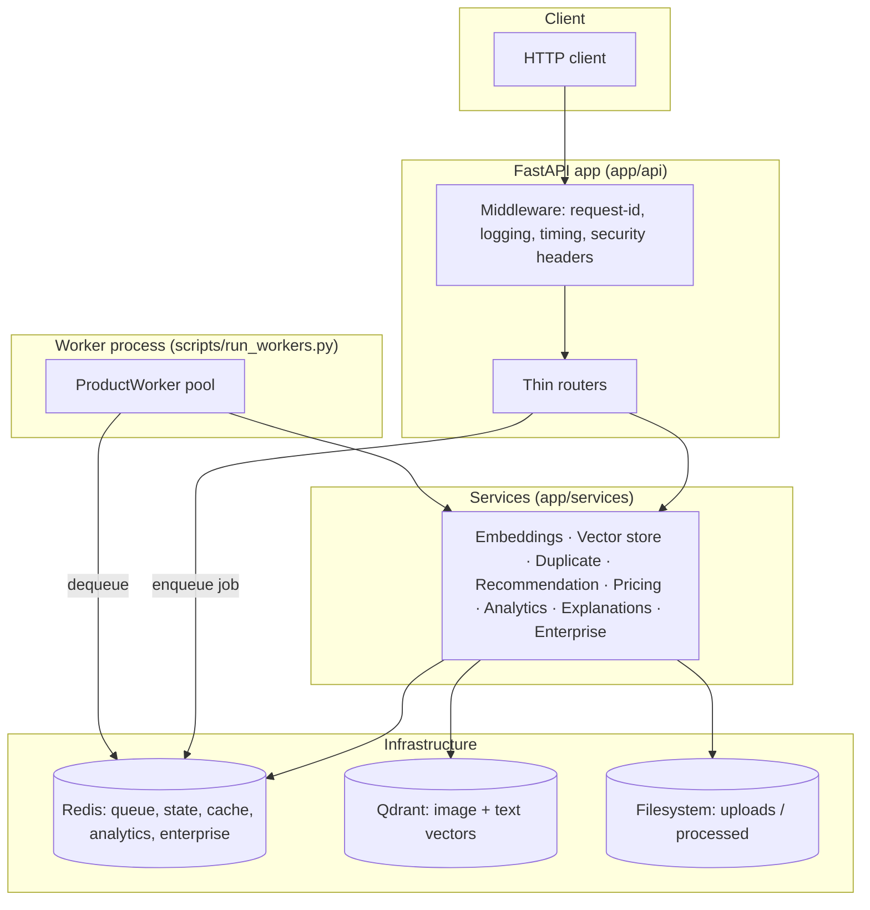
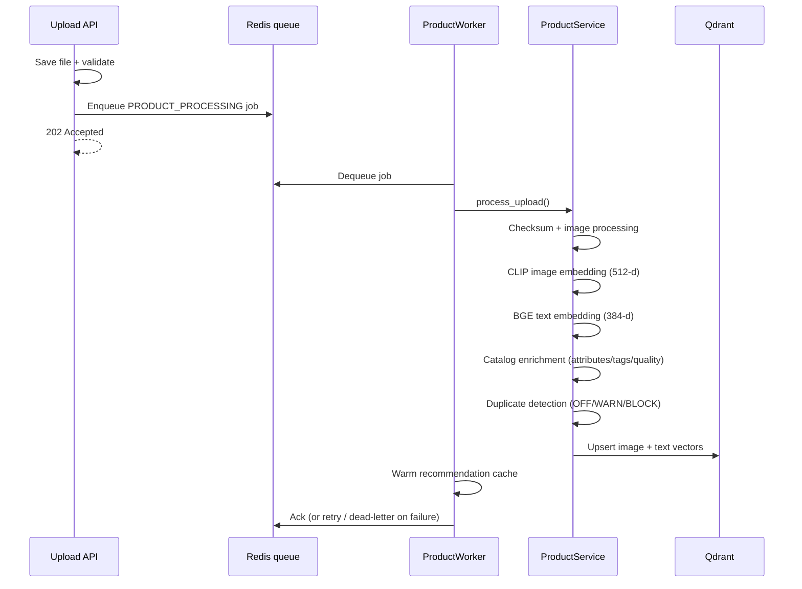

<!--
The YAML block above configures this directory when it is published as a
Hugging Face Space (see docs/DEPLOY.md). Hugging Face reads only the
front matter and renders everything below it as the Space description, so
this stays a normal backend README everywhere else. `app_port` must match
the port scripts/start_all.py binds uvicorn to.
-->

# Product Intelligence Platform

> A multi-modal product intelligence engine that turns a product image and its metadata into search, recommendations, duplicate detection, and price estimates — built as a fully-typed, test-driven FastAPI backend.

<p>
  <a href="https://github.com/Vikas9892/product_intelligence/actions/workflows/ci.yml"></a>
  
  
  
  
  
  
  
  
</p>

**Highlights** — Multi-modal AI · Hybrid search · Recommendation engine · Duplicate detection · Deterministic pricing · Explainable decisions · Opt-in enterprise multi-tenancy

---

## Table of contents

- [What this project does](#what-this-project-does)
- [Key features](#key-features)
- [Architecture](#architecture)
- [AI pipeline](#ai-pipeline)
- [Technology stack](#technology-stack)
- [Repository structure](#repository-structure)
- [API overview](#api-overview)
- [Getting started](#getting-started)
- [Running locally](#running-locally)
- [Testing](#testing)
- [Performance philosophy](#performance-philosophy)
- [Security](#security)
- [Future work](#future-work)
- [Documentation](#documentation)
- [Contributing](#contributing)
- [License](#license)

---

## What this project does

You upload a product (an image plus fields such as name, brand, category, price). The platform:

1. **Standardizes the image** — orientation, color mode, and size are normalized.
2. **Generates two embeddings** — a **CLIP** image vector and a **BGE** text vector.
3. **Enriches the catalog entry** — extracts attributes, generates tags, and scores quality.
4. **Checks for duplicates** — against everything already indexed.
5. **Indexes it** into a vector store so it is immediately searchable.
6. **Serves intelligence over it** — hybrid search, similar-product recommendations, fair-price estimates, and per-decision explanations.

Heavy work runs on a **background worker pool**, so uploads return immediately while processing happens asynchronously.



---

## Key features

| Domain | What it solves | How it works |
|---|---|---|
| **Async ingestion** | Uploads shouldn't block on model inference | File is saved, a job is queued, `202 Accepted` is returned; a worker pool processes it |
| **Multi-modal embeddings** | Products are both visual and textual | CLIP image vectors (512-d) + BGE text vectors (384-d) |
| **Hybrid search** | Neither image nor text alone is enough | Weighted fusion: `0.7 × image + 0.3 × text` |
| **Cross-encoder reranking** | Bi-encoder recall needs precision refinement | Optional cross-encoder re-scores the top candidates |
| **Recommendations** | "Show me similar products" | Retrieval + multi-signal scoring + brand-diversity filter, cache-warmed by the worker |
| **Duplicate detection** | Catalogs accumulate near-duplicates | Weighted-similarity decision (`OFF`/`WARN`/`BLOCK`) plus an optional explainable cross-encoder verifier |
| **Pricing intelligence** | Estimate a fair price from comparables | Deterministic aggregation (trimmed mean / weighted average / median) with IQR outlier removal |
| **Explainability** | Decisions must be auditable | Structured traces for recommendations, duplicates, and rankings |
| **Analytics** | Usage and pipeline visibility | REST reports over Redis daily buckets |
| **Observability** | Production insight | Prometheus metrics, health/readiness probes, structured logging |
| **Enterprise (opt-in)** | Multi-tenant SaaS readiness | API keys, RBAC, tenant isolation, audit logging, usage quotas |

---

## Architecture

Clean, layered architecture with strict boundaries and dependency injection throughout. Routers are thin; all logic lives in services; persistence is isolated behind repositories, a vector-store abstraction, and a queue abstraction.



> [!NOTE]
> The API process and the worker process are separate. `uvicorn app.main:app` never runs the worker pool — that is `scripts/run_workers.py`. See [ARCHITECTURE.md](./ARCHITECTURE.md) for the full design.

---

## AI pipeline



| Model | Role | Dimensions | Default |
|---|---|---|---|
| `openai/clip-vit-base-patch32` | Image embeddings | 512 | Active |
| `BAAI/bge-small-en-v1.5` | Text embeddings | 384 | Active |
| `cross-encoder/ms-marco-MiniLM-L-6-v2` | Reranking & duplicate verification | scalar score | Opt-in |

> [!IMPORTANT]
> The cross-encoder is **off by default** — enabling it loads a real transformer and runs it on every applicable request. The OpenAI/LLM keys present in configuration are reserved shape only; **no external LLM calls are made**.

---

## Technology stack

| Layer | Technology |
|---|---|
| **Language / runtime** | Python 3.12, `uv` package manager |
| **Web framework** | FastAPI + Uvicorn |
| **Image embeddings** | CLIP via `transformers` + `torch` |
| **Text embeddings** | `sentence-transformers` (BGE) |
| **Reranking** | `sentence-transformers` CrossEncoder |
| **Vector store** | Qdrant (`qdrant-client`) |
| **Queue / state / cache** | Redis (`redis` async client) |
| **Config** | `pydantic-settings` (validated, nested) |
| **Metrics** | `prometheus-client` + `prometheus-fastapi-instrumentator` |
| **Fuzzy matching** | `rapidfuzz` |
| **Testing** | pytest, pytest-asyncio, pytest-cov, fakeredis, httpx |
| **Quality gate** | ruff, black, mypy, pre-commit |

> [!NOTE]
> There is **no relational database** in this project. Persistence is Qdrant (vectors) + Redis (queue, state, cache, analytics, enterprise) + the filesystem (image artifacts). A `DATABASE__URL` exists in configuration as reserved shape but is not used by any code path.

---

## Repository structure

```
backend/
├── app/
│   ├── api/            # Thin HTTP routers (one per domain)
│   ├── services/       # All business logic, grouped by domain
│   ├── models/         # Pydantic domain models
│   ├── schemas/        # API request/response schemas
│   ├── repositories/   # Redis-backed persistence
│   ├── queue/          # Async job-queue abstraction + Redis impl
│   ├── jobs/           # Job domain types
│   ├── workers/        # ProductWorker + WorkerManager
│   ├── metrics/        # Prometheus MetricsRegistry
│   ├── middleware/     # request-id, logging, timing, security headers
│   ├── dependencies/   # DI providers (cached singletons)
│   ├── core/           # settings, config, constants, logging, paths
│   ├── exceptions/     # typed exceptions + global handlers
│   ├── utils/          # pure image/text/metadata helpers
│   ├── validators/     # file/image/product validators
│   ├── application.py  # create_app() factory
│   ├── lifespan.py     # startup/shutdown
│   └── main.py         # app = create_app()
├── scripts/            # run_workers.py, benchmark.py
├── tests/              # 159 test files mirroring app/
├── evaluation/         # retrieval evaluation dataset
└── storage/            # uploads/ and processed/ artifacts
```

Each folder has a single responsibility — see [ARCHITECTURE.md](./ARCHITECTURE.md#folder-responsibilities) for details.

---

## API overview

All business routes are mounted under `/api/v1`. Optional domains only register when their feature flag is enabled.

| Group | Representative endpoints |
|---|---|
| **Products** | `POST /products/upload`, `POST /products/check-duplicate`, `GET /products/{id}/status`, `GET /products/{id}/recommendations` |
| **Search** | `POST /products/search` |
| **Pricing** *(flag)* | `POST /pricing/estimate`, `GET /pricing/{product_id}` |
| **Explanations** | `GET /recommendations/{id}/trace`, `/duplicates/{id}/trace`, `/products/{id}/explanations` |
| **Jobs** | `GET /jobs/{job_id}`, `GET /jobs/dead-letter` |
| **Evaluation** *(flag)* | `POST /evaluation/run`, `POST /evaluation/compare-reranking` |
| **Models** | `GET /models`, `/models/{type}`, `/models/{type}/active` |
| **Analytics** *(flag)* | `GET /analytics/{dashboard,models,pipeline,trends}` |
| **Enterprise** *(flag)* | `POST/GET /organizations`, `POST/GET /api-keys`, `DELETE /api-keys/{prefix}`, `GET /audit`, `GET /usage` |
| **Ops** | `GET /health`, `/ready`, `/version`, `/system/health`, `/system/stats`, `/metrics` |

Interactive OpenAPI docs are served at `/docs` when the app is running.

---

## Getting started

> [!TIP]
> To run the whole platform — API, worker, Redis, Qdrant and the web frontend — with only
> Docker installed and no Python on the host, use `make up-prod` from the repository root.
> See **[DOCKER.md](../DOCKER.md)**. The rest of this section covers running the backend
> natively, which is still the fastest loop for backend development.

**Prerequisites**

- Python 3.12
- [`uv`](https://docs.astral.sh/uv/)
- **Docker**, which supplies the two backing services below (or native installs of them)
  - **Redis** — async pipeline, state, cache, analytics, enterprise data
  - **Qdrant** — image + text vector search

**Install**

```bash
cd backend
uv sync
cp .env.example .env   # every value defaults sensibly; edit only what you need
```

> [!NOTE]
> On first inference the CLIP and BGE models are downloaded from Hugging Face and cached locally.

---

## Running locally

**1. Start Redis and Qdrant** — from the **repo root** (one level up), the committed
compose file starts both on the expected defaults (`redis://localhost:6379/0`,
`http://localhost:6333`) and waits until they report healthy:

```bash
make services-up          # or: docker compose up -d --wait
```

Verify:

```bash
curl http://localhost:6333/collections   # {"result":{"collections":[]},"status":"ok",...}
docker exec pi-redis redis-cli ping      # PONG
```

The two collections (`product_images`, 512-d and `product_text`, 384-d) are auto-created
on first use, so an empty Qdrant is the expected starting state.

**2. Start the API**

```bash
uv run uvicorn app.main:app --reload
```

**3. Start the worker pool** (separate terminal — required for async uploads)

```bash
uv run python scripts/run_workers.py
```

**4. Try it** — open `http://localhost:8000/docs`, or:

```bash
curl http://localhost:8000/health
```

See [DEMO.md](./DEMO.md) for an end-to-end walkthrough and [DEPLOYMENT.md](./DEPLOYMENT.md) for configuration and production notes.

> [!TIP]
> For quick local experiments without Redis, set `ASYNC_PIPELINE__ENABLED=false` to fall back to fully-synchronous uploads.

---

## Testing

```bash
uv run pytest              # full suite with coverage
uv run ruff check .        # lint
uv run black --check .     # format check
uv run mypy .              # type check
```

| Metric | Value |
|---|---|
| Tests | **1327 passing** |
| Branch coverage | **99%** |
| Test files | 159 (mirror the package layout) |
| Async tests | `pytest-asyncio` (auto mode) |
| Redis in tests | `fakeredis` (no real Redis needed) |

The suite is enforced with `--strict-markers --strict-config`, and ruff/black/mypy run as pre-commit hooks.

---

## Performance philosophy

- **Async-first ingestion** — model inference never blocks the request thread; uploads enqueue and return `202`.
- **Off-loop inference** — model calls run in a thread pool so the event loop stays responsive.
- **Lazy, cached model loading** — models load once, on first use, and are reused.
- **Overfetch-then-rerank** — cheap bi-encoder retrieval first, expensive cross-encoder only on the shortlist (and only when enabled).
- **Idempotent, retryable jobs** — vector writes are upserts keyed by product id, so retries converge instead of duplicating.

A `scripts/benchmark.py` harness exists for measuring the retrieval pipeline. **No benchmark numbers are published here** — measure on your own hardware and data.

---

## Security

- **API-key authentication** — high-entropy `pik_` tokens, SHA-256 hashed at rest, constant-time verification.
- **RBAC** — `owner` / `admin` / `member` / `viewer` with cumulative permissions and no privilege escalation.
- **Tenant isolation** — per-tenant namespacing of vector collections and Redis keys.
- **Audit logging** — key-management actions recorded per tenant.
- **Usage quotas** — per-tenant daily and per-minute limits.
- **Always-on hardening** — security-headers middleware, trusted-host and CORS controls, production secret-key validation at startup, and image decompression-bomb protection.

> [!NOTE]
> The enterprise auth layer is **opt-in** (`ENTERPRISE__ENABLED=false` by default). With it off, the platform runs single-tenant and unauthenticated, exactly as in earlier phases.

---

## Future work

Continuous integration is already in place — a GitHub Actions workflow runs the full quality gate (ruff, black, mypy, pytest) on every push and pull request to `main`. The remaining planned milestone is **production deployment**, none of which currently exists in the repository:

- Containerization (Docker / Compose)
- Orchestration (Kubernetes) and infrastructure-as-code (Terraform)
- Cloud deployment (AWS) and a hosted demo
- A frontend client

See [DEPLOYMENT.md](./DEPLOYMENT.md) for where these placeholders live.

---

## Documentation

| Document | Purpose |
|---|---|
| [ARCHITECTURE.md](./ARCHITECTURE.md) | Deep technical design, pipelines, diagrams |
| [DEPLOYMENT.md](./DEPLOYMENT.md) | Configuration, runtime, and deployment notes |
| [DEMO.md](./DEMO.md) | End-to-end walkthrough |
| [CHANGELOG.md](./CHANGELOG.md) | Version history by phase |
| [CONTRIBUTING.md](./CONTRIBUTING.md) | Contribution workflow and standards |

---

## Contributing

Contributions are welcome — please read [CONTRIBUTING.md](./CONTRIBUTING.md). Every change must pass the full quality gate (ruff, black, mypy, pytest) before it is merged.

## License

License **to be determined** — no license file is currently included in the repository. Until one is added, all rights are reserved by the authors.
