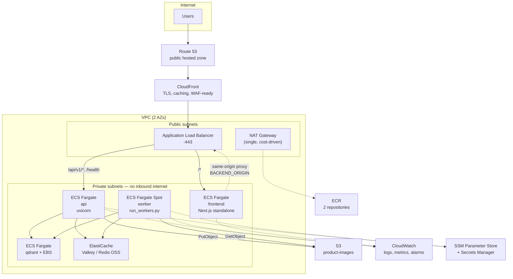
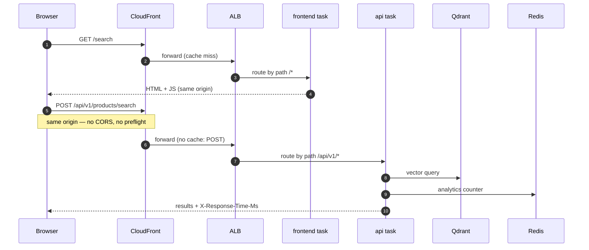
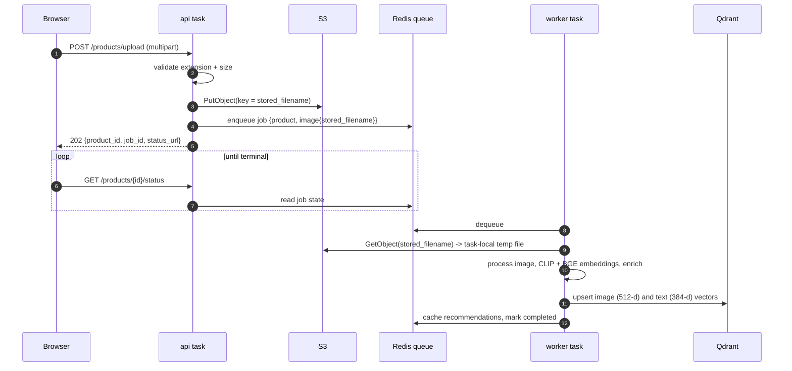
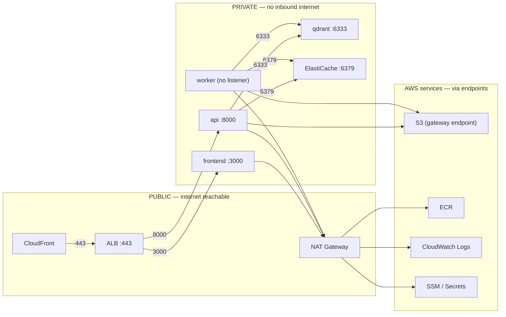
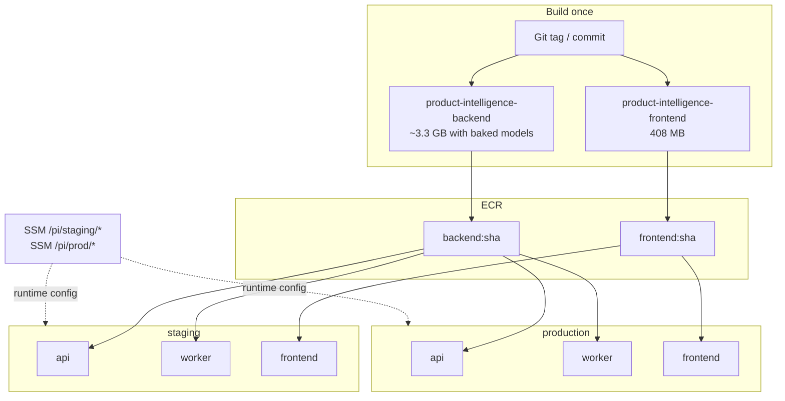
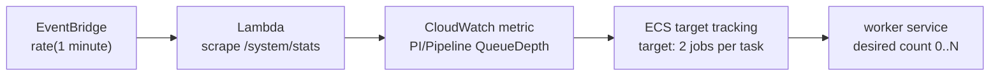
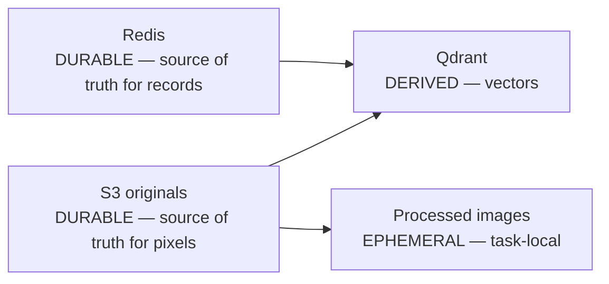

# AWS Production Architecture

> **Status: design only.** No AWS resources exist. No Terraform is written. This document
> and the ADRs beside it are the decisions Stage 11 will implement.

The target is deliberately modest: the **simplest architecture that is genuinely
production-shaped**. Every service here earns its place by solving a problem this
application actually has. Services that would only decorate the diagram are named in
[Rejected alternatives](#rejected-alternatives) with the reason.

## Contents

- [What the application actually is](#what-the-application-actually-is)
- [Recommended architecture](#recommended-architecture)
- [Request path](#request-path)
- [Upload and worker pipeline](#upload-and-worker-pipeline)
- [Network boundaries](#network-boundaries)
- [Deployment topology](#deployment-topology)
- [Decision summary](#decision-summary)
- [Scaling](#scaling)
- [Observability](#observability)
- [Backups and failure modes](#backups-and-failure-modes)
- [Environments](#environments)
- [Application changes required](#application-changes-required)
- [Rejected alternatives](#rejected-alternatives)

---

## What the application actually is

Every decision below is grounded in measurements taken from the running Compose stack,
not assumptions. The numbers that shaped the design:

| Observation | Measured | Consequence |
|---|---|---|
| Worker resident memory, models loaded | **1.15 GiB** | Worker task needs ~4 GB, not 8 |
| API resident memory, models loaded | **602 MiB** | The API loads models too — it is not a thin proxy |
| Frontend resident memory | **52 MiB** | Smallest possible task is fine |
| Model cache on disk | **1.3 GB** | Fits inside Fargate's included 20 GB ephemeral storage |
| Backend image | **2.06 GB** | ~3.3 GB if models are baked in |
| Uploaded originals (8 products) | **204 KB** | Object storage cost is a rounding error |
| Qdrant storage (16 vectors) | **836 KB** | A single small node is oversized already |
| Redis dataset | **104 KB** | Smallest managed node is oversized already |
| First job, cold models | **215 s** | Cold-start is the dominant latency risk |
| Subsequent jobs, warm | **18 s** | …and it is entirely a model-loading problem |

Two structural facts matter more than any of those numbers.

**Redis is the system of record, not a cache.** It holds products, job state, the
dead-letter queue, analytics buckets and enterprise tenant data. There is no relational
database — `settings.database` is referenced nowhere outside a docstring. Losing Redis
loses the catalog.

**The API and worker exchange an opaque key, not a path.** This was the constraint Stage 8
flagged as the hard problem, and inspecting it closely made it much smaller.
`ProductImage` carries `stored_filename` — a generated identifier chosen specifically to
never be a path — and *each side independently joins it* to its own configured
`upload_dir`. The contract crossing the process boundary is already "a shared namespace of
opaque keys", which is precisely S3's model. See [ADR-002](./ADR-002-storage.md).

---

## Recommended architecture

Everything the browser touches is CloudFront and the ALB. **Redis, Qdrant, the worker and
every ECS task live in private subnets with no inbound path from the internet.**

---

## Request path

The frontend proxies the API rather than the browser calling it directly. That is not
incidental — it is load-bearing, and it survives unchanged into AWS.

Two ALB target groups, routed by path, behind one listener:

| Path pattern | Target group | Why |
|---|---|---|
| `/api/v1/*`, `/health`, `/ready`, `/version` | `api` | The backend's real routes |
| `/*` (default) | `frontend` | Everything else is the Next.js app |

Routing `/api/v1/*` at the ALB rather than through the Next.js proxy saves one internal
hop for browser-originated API calls. The Next.js rewrite stays configured and functional
— it is what makes local development work, and it remains the fallback — but in AWS the
ALB short-circuits it. `BACKEND_ORIGIN` still points at the ALB so server-side rendering
and any proxied route continue to work.

> The backend's CORS allowlist stays empty and its `X-Response-Time-Ms` header stays
> readable, because everything is still one origin. This is exactly why the frontend was
> built with a same-origin proxy in the first place.

---

## Upload and worker pipeline

This is the flow that changes most, and the change is confined to how the image is moved.

The job payload is **unchanged** — it already carries `stored_filename`, not a path. Only
the four places that join that name to a local directory change. See
[ADR-002](./ADR-002-storage.md#the-refactor).

---

## Network boundaries

Security groups are referenced by **group id, not CIDR**, so the rules read as service
relationships:

| Security group | Inbound | From |
|---|---|---|
| `alb-sg` | 443 | CloudFront prefix list (`com.amazonaws.global.cloudfront.origin-facing`) |
| `frontend-sg` | 3000 | `alb-sg` only |
| `api-sg` | 8000 | `alb-sg` only |
| `worker-sg` | *(none)* | Nothing. It opens no listener. |
| `qdrant-sg` | 6333 | `api-sg`, `worker-sg` |
| `redis-sg` | 6379 | `api-sg`, `worker-sg` |

**Nothing reaches Redis or Qdrant except the API and worker.** The worker accepts no
inbound traffic at all — consistent with the Stage 8 decision to give it no health check,
because it has no port to probe.

Full detail, including IAM policies and secret handling, is in [SECURITY.md](./SECURITY.md).

---

## Deployment topology

**One backend image runs both the API and the worker**, selected by the container command
— exactly as it does in Compose today. The same image artifact is promoted from staging to
production; only SSM parameters differ. No environment-specific build exists, which is
what makes "the thing we tested is the thing we shipped" true rather than aspirational.

---

## Decision summary

| # | Decision | Choice | ADR |
|---|---|---|---|
| 1 | Compute | ECS Fargate for all three services; Fargate **Spot** for the worker | [ADR-001](./ADR-001-compute.md) |
| 2 | Object storage | **S3**, replacing the shared `app_storage` volume | [ADR-002](./ADR-002-storage.md) |
| 3 | Redis | **ElastiCache**, single `cache.t4g.micro`, snapshots on | [ADR-003](./ADR-003-redis.md) |
| 4 | Qdrant | **Self-hosted on ECS Fargate + EBS**, private subnet | [ADR-004](./ADR-004-qdrant.md) |
| 5 | Model delivery | **Bake models into the image** | [ADR-005](./ADR-005-model-delivery.md) |
| 6 | Networking | 2 AZs, single NAT, ALB + CloudFront, SSM/Secrets | [SECURITY.md](./SECURITY.md) |

---

## Scaling

The three services scale independently because they fail and saturate for different
reasons.

| Service | Driver | Metric | Notes |
|---|---|---|---|
| `frontend` | Concurrent page loads | `ALBRequestCountPerTarget`, CPU | Cheap and stateless; scales fastest |
| `api` | Request rate | `ALBRequestCountPerTarget`, CPU | Holds models in memory, so scaling out costs ~600 MB per task |
| `worker` | **Queue depth** | Custom `QueueDepth` metric | The only one that should scale on backlog, not CPU |

**Worker scaling deserves the detail**, because CPU-based scaling would be actively wrong
here: a worker blocked on a 20-second CLIP inference looks busy, and a worker with an empty
queue looks idle — neither tells you whether work is piling up.

Queue depth lives in Redis, which CloudWatch cannot see. The application already exposes it
at `GET /api/v1/system/stats` (`queue_depth`, `dead_letter_size`). The lowest-cost bridge
that requires **no application change**:

Scaling the worker **to zero** when the queue is empty is both the correct behavior and the
single biggest cost lever in this design — the worker is the most expensive task. Cold start
is bounded by image pull, not model download, because the models are baked in
([ADR-005](./ADR-005-model-delivery.md)).

Not implemented in this stage.

---

## Observability

The application's existing observability maps onto AWS with almost no new machinery, which
is the point — an expensive observability stack is not justified at this traffic.

| Existing | AWS mapping | Cost posture |
|---|---|---|
| Structured logs to **stdout** | `awslogs` driver → CloudWatch Logs | Retention **14 days** in prod, **3 days** in staging |
| `GET /health` (pure liveness, no dependencies) | ALB target group health check | Deliberate: a Redis blip must not fail the target |
| `GET /ready` | ECS container health check | |
| `GET /api/v1/system/health` | Alarm source via the same Lambda scraper | Reports Redis/Qdrant reachability |
| `GET /metrics` (Prometheus, 703 lines) | **Not scraped by AMP** | See below |
| `X-Request-Id` on every response | Log correlation | Already emitted |

**Prometheus is deliberately not wired to Amazon Managed Prometheus.** AMP plus a Grafana
workspace would cost more per month than the entire compute budget, to observe a system
with single-digit requests per minute. The handful of metrics that would actually drive an
action — queue depth, dead-letter size, worker count — are published as CloudWatch custom
metrics by the same scraper Lambda. `/metrics` stays exposed for a live demonstration and
for the day the traffic justifies a real TSDB.

Alarms worth having, and no more:

| Alarm | Condition | Why it matters |
|---|---|---|
| `api-5xx` | ALB `HTTPCode_Target_5XX_Count` > 0 for 5 min | User-visible failure |
| `api-unhealthy` | `UnHealthyHostCount` >= 1 | Deploy or crash loop |
| `queue-backlog` | `QueueDepth` > 20 for 10 min | Worker starved, stuck or scaled to zero incorrectly |
| `dead-letters` | `DeadLetterSize` > 0 | A job exhausted retries — **the Stage 9 worker bug would have fired this** |
| `redis-memory` | `DatabaseMemoryUsagePercentage` > 75% | Redis is the system of record; eviction loses data |

---

## Backups and failure modes

The critical distinction is **what is durable versus what is derived**, because it decides
what must be backed up and what can simply be rebuilt.

| Failure | Blast radius | Recovery | Reconstructible? |
|---|---|---|---|
| **Redis loss** | Catastrophic — products, jobs, analytics, tenants | Restore latest ElastiCache snapshot | **No.** This is the one true system of record. |
| **Qdrant loss** | Search, recommendations, pricing and dedup all stop | Re-run the pipeline over S3 originals | **Yes** — vectors are derived from S3 + Redis |
| **S3 object loss** | Original pixels gone; vectors survive but cannot be regenerated | Restore from version history | **No** → versioning + MFA-delete-off lifecycle |
| **Worker crash** | Jobs stall, none lost | ECS replaces the task; jobs retry, then DLQ | Yes — already built and verified |
| **API crash** | 5xx until replaced | ECS replaces; ALB drains | Yes |
| **Model download failure** | *Eliminated* | Models are in the image | N/A — [ADR-005](./ADR-005-model-delivery.md) |
| **AZ failure** | Degraded; single-NAT design loses egress if that AZ dies | Tasks reschedule into the surviving AZ | Partial — see below |

Two honest weaknesses in the portfolio configuration, both deliberate cost trades:

**A single NAT Gateway is an AZ-level single point of failure for outbound traffic.**
Production would run one per AZ (+$32/month). Documented rather than hidden.

**A single-node ElastiCache has no automatic failover.** A node failure means restoring
from snapshot, with data loss back to the last snapshot. Production adds a replica and
Multi-AZ (roughly doubles that line item).

---

## Environments

Three environments, **one image**, differing only in runtime configuration — which is
already how the application works and did not need designing.

| | local | staging | production |
|---|---|---|---|
| Compute | Docker Compose | ECS Fargate | ECS Fargate |
| Redis | container | ElastiCache `t4g.micro` | ElastiCache `t4g.micro` (+replica when it matters) |
| Qdrant | container | ECS + EBS | ECS + EBS |
| Objects | local volume | S3 `pi-staging-images` | S3 `pi-prod-images` |
| Config | `.env`, compose `environment:` | SSM `/pi/staging/*` | SSM `/pi/prod/*` |
| Log retention | none | 3 days | 14 days |
| `APPLICATION__ENVIRONMENT` | `local` | `staging` | `staging` — see note |

> **Why production also runs `staging`.** The backend refuses to boot when
> `APPLICATION__ENVIRONMENT=production` unless `database.url` is non-SQLite — but this
> platform has no relational database at all. Selecting `production` would mean inventing a
> Postgres URL that nothing connects to. Everything that validator protects (debug off, no
> wildcard trusted hosts, a real secret key) is set explicitly instead. This is the same
> reasoning documented in Stage 8's `docker-compose.prod.yml`, and it is a **backend
> change worth making later** — see [Application changes required](#application-changes-required).

The frontend needs no per-environment build: Stage 8's sentinel-substitution entrypoint
already resolves `BACKEND_ORIGIN` at container start, so one image serves every
environment. That decision was made for Compose and pays off again here.

---

## Application changes required

Ordered by necessity. **Only the first is required to deploy.**

| # | Change | Size | Why |
|---|---|---|---|
| 1 | **S3 object store behind the existing interfaces** | ~4 call sites + 1 new module | API and worker are separate tasks with separate filesystems. [ADR-002](./ADR-002-storage.md#the-refactor) |
| 2 | Bake models in the Dockerfile | ~5 lines | [ADR-005](./ADR-005-model-delivery.md) |
| 3 | Redis TLS + auth token support | Config only, if `redis://` → `rediss://` is accepted | ElastiCache encryption in transit |
| 4 | Clean up transient query images | Small | Search and duplicate-check write query images that are **never deleted** — found during this audit. S3 lifecycle rules solve it without app changes, but the write path should ideally use a temp prefix. |
| 5 | Decouple the `production` environment check from `database.url` | Small validator change | So production can honestly call itself production |

Items 3–5 are quality improvements, not blockers. None are in scope for Stage 10 or 11.

---

## Rejected alternatives

Recorded so the reasoning survives, and so a reviewer can see what was considered rather
than assumed.

| Rejected | Why |
|---|---|
| **S3 + CloudFront static frontend** | Incompatible. `next.config.ts` sets `output: "standalone"` and defines `rewrites()` — this app requires a running Node server. `output: "export"` would delete the proxy the whole frontend architecture depends on. |
| **App Runner** | Fits the API and frontend, but **cannot run the worker** — it is request-driven and has no queue-consumer model. Splitting compute across two paradigms to save a little config is a worse story than one consistent ECS model. |
| **ECS on EC2** | Cheaper at sustained load and a legitimate cost lever, but adds instance patching, capacity providers and AMI lifecycle for a workload measured in single-digit RPS. Named as the scale-up path in [COST.md](./COST.md). |
| **EKS / Kubernetes** | Control plane alone costs more than this entire deployment. No requirement it serves. |
| **EFS for `app_storage`** | Its one genuine advantage — zero application change — is outweighed once you see the handoff is already an opaque key. [ADR-002](./ADR-002-storage.md) |
| **OpenSearch / Aurora `pgvector` instead of Qdrant** | Would replace a working, tested vector layer to use a different AWS logo. `qdrant-client` is pinned and two collections are in active use. Explicitly out of scope. |
| **Amazon MQ / SQS instead of the Redis queue** | SQS is the better queue in isolation, but Redis is already the system of record; adding SQS means two stateful systems and an application rewrite of the retry/DLQ machinery that already works and is tested. |
| **Amazon Managed Prometheus + Grafana** | Costs more than the compute it would observe, at this traffic. See [Observability](#observability). |
| **PostgreSQL** | The application has no relational data. Adding one would be scaffolding for its own sake. |
| **Multi-region** | No availability requirement justifies it. |
