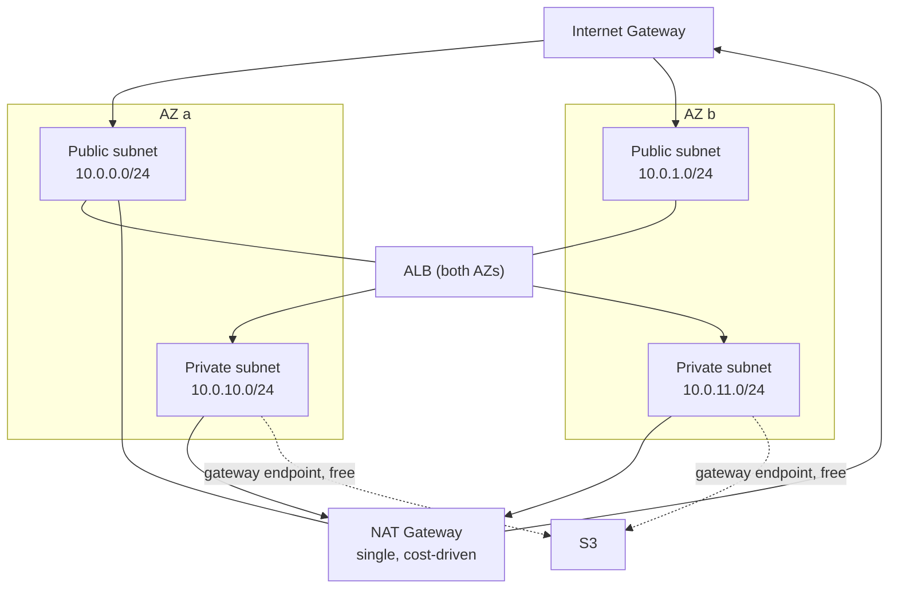

# Security design

> **Status: design only.** Nothing is deployed. This is the security posture Stage 11 must
> implement.

The governing rule: **only CloudFront and the ALB are reachable from the internet.**
Everything else — the frontend and API tasks, the worker, Redis and Qdrant — lives in
private subnets with no inbound internet path.

## Contents

- [Exposure map](#exposure-map)
- [Network design](#network-design)
- [Security groups](#security-groups)
- [IAM roles](#iam-roles)
- [Secrets and configuration](#secrets-and-configuration)
- [TLS](#tls)
- [Data protection](#data-protection)
- [What this design does not do](#what-this-design-does-not-do)

---

## Exposure map

| Component | Internet-accessible? | Reachable from |
|---|---|---|
| Route 53 | Yes (DNS) | Anywhere |
| CloudFront | **Yes** | Anywhere |
| ALB | **Yes**, restricted to the CloudFront prefix list | CloudFront only |
| `frontend` task | No | ALB only |
| `api` task | No | ALB only |
| `worker` task | No | **Nothing.** It opens no listener. |
| Qdrant | No | `api`, `worker` |
| ElastiCache | No | `api`, `worker` |
| S3 bucket | No — block public access on, gateway endpoint | `api` (write), `worker` (read) |
| ECR, CloudWatch, SSM, Secrets Manager | No | Tasks via NAT or interface endpoints |

Restricting the ALB to CloudFront's managed prefix list matters: without it, the ALB's
DNS name is a second public entrance that bypasses CloudFront's TLS policy and any future
WAF rules.

---

## Network design

| Layer | Contents | Route to internet |
|---|---|---|
| **Public subnets** (2 AZs) | ALB nodes, NAT Gateway | Internet Gateway |
| **Private subnets** (2 AZs) | All ECS tasks, ElastiCache, Qdrant EBS-backed task | Outbound only, via NAT |

**Egress is needed for exactly three things**: pulling images from ECR, shipping logs to
CloudWatch, and reading SSM/Secrets Manager at task start. Model downloads are *not* on
that list — [ADR-005](./ADR-005-model-delivery.md) bakes them into the image, which removes
both the Hugging Face dependency and its NAT data charges.

**S3 uses a gateway endpoint**, which is free and keeps object traffic off the NAT entirely.
This is the single most effective NAT-cost decision available, because S3 is the only
high-volume egress path in the design.

> **A single NAT Gateway is a deliberate cost trade.** One NAT (~$32/month) instead of one
> per AZ (~$65/month) means an AZ failure takes out egress for tasks in that AZ. Production
> would run one per AZ. Stated here rather than discovered later.

Replacing NAT entirely with interface endpoints for ECR, ECR Docker, CloudWatch Logs, SSM
and Secrets Manager was considered: five endpoints at roughly $7/month each lands near the
NAT price with less flexibility. Not obviously cheaper, so NAT stays — but the option is
recorded in [COST.md](./COST.md).

---

## Security groups

Rules reference **security group ids, not CIDR blocks**, so each rule states a service
relationship and stays correct when subnets change.

| Group | Inbound | Source | Outbound |
|---|---|---|---|
| `alb-sg` | 443 | CloudFront managed prefix list | 3000 → `frontend-sg`, 8000 → `api-sg` |
| `frontend-sg` | 3000 | `alb-sg` | 443 (ECR, logs), 8000 → `api-sg` |
| `api-sg` | 8000 | `alb-sg` | 6379 → `redis-sg`, 6333 → `qdrant-sg`, 443 (S3, logs, SSM) |
| `worker-sg` | **none** | — | 6379 → `redis-sg`, 6333 → `qdrant-sg`, 443 (S3, logs, SSM) |
| `qdrant-sg` | 6333 | `api-sg`, `worker-sg` | 443 (logs) |
| `redis-sg` | 6379 | `api-sg`, `worker-sg` | — |

`worker-sg` having **no inbound rules at all** is the design working as intended: the worker
consumes from a queue and serves nothing. It is also why it carries no health check —
consistent with the Stage 8 decision, for the same reason.

---

## IAM roles

Two roles per service, because they are used at different times by different principals.

**Execution roles** (used by the ECS agent, before the container starts): pull from ECR,
write to CloudWatch Logs, and read the specific SSM parameters and secrets injected into
that task definition. Scoped per service so the frontend's execution role cannot read
backend secrets.

**Task roles** (assumed by the running application) — this is where least privilege earns
its keep, and where S3 makes it expressible at all:

| Role | Permissions | Notes |
|---|---|---|
| `frontend-task` | *(none)* | It talks to the ALB and nothing else in AWS |
| `api-task` | `s3:PutObject` on `pi-{env}-images/originals/*` and `queries/*` | **Write only.** No `GetObject`, no `DeleteObject`, no `ListBucket` |
| `worker-task` | `s3:GetObject` on the same prefixes; `cloudwatch:PutMetricData` if it ever publishes | **Read only.** It never writes originals |
| `scraper-lambda` | `cloudwatch:PutMetricData` on the `PI/Pipeline` namespace | Publishes queue depth for autoscaling |

The API being unable to *read* uploads, and the worker unable to *write* them, is a real
boundary that a shared filesystem cannot express — one of the concrete arguments for S3 in
[ADR-002](./ADR-002-storage.md).

No wildcards on resources. No `iam:PassRole` beyond what ECS requires.

---

## Secrets and configuration

Split by sensitivity, which also happens to be the cheaper arrangement:

| Kind | Store | Cost | Examples |
|---|---|---|---|
| Non-secret configuration | **SSM Parameter Store**, standard tier | Free | `VECTOR_STORE__URL`, `ASYNC_PIPELINE__WORKER_CONCURRENCY`, `APPLICATION__TRUSTED_HOSTS`, `S3_BUCKET` |
| Actual secrets | **Secrets Manager** | ~$0.40/secret/month | `SECURITY__SECRET_KEY`, the ElastiCache AUTH token |

Parameters are namespaced per environment — `/pi/staging/*`, `/pi/prod/*` — so an
environment's task role grants access to its own path only.

Both are injected as container `secrets` in the task definition, so values arrive as
environment variables and **never appear in an image, a repository, or a task definition
body**. This continues the Stage 8 posture where `.dockerignore` excludes `.env` and Compose
injects configuration at runtime.

Secrets Manager is used sparingly and deliberately: two secrets cost under a dollar a month,
whereas putting every parameter there would cost more than the DNS.

---

## TLS

| Hop | Encryption |
|---|---|
| Browser → CloudFront | TLS 1.2+, ACM certificate (free), HTTPS-only, HSTS |
| CloudFront → ALB | TLS, ACM certificate in the ALB's region |
| ALB → tasks | **Plaintext HTTP inside the VPC** |
| API/worker → ElastiCache | TLS (`rediss://`) with an AUTH token |
| API/worker → Qdrant | Plaintext HTTP inside the VPC |
| Tasks → S3 | TLS via the gateway endpoint |

Terminating TLS at the ALB and using plaintext on the private hops is the conventional
trade: the traffic never leaves private subnets, and the alternative means managing
certificates inside every container for no threat this design faces. ElastiCache is the
exception because it is the system of record and managed TLS there costs nothing to enable.

The backend already emits `Strict-Transport-Security`, `X-Content-Type-Options`,
`X-Frame-Options` and `Referrer-Policy` — verified by the Stage 9 smoke suite — so header
hardening needs no new infrastructure.

---

## Data protection

| Store | At rest | Versioning / backup | Public access |
|---|---|---|---|
| S3 | SSE-S3 | Versioning on; lifecycle expires `queries/` after 1 day | Block Public Access, all four settings on |
| ElastiCache | Encrypted | Automatic snapshots, 7-day retention | Never public; no public subnet |
| Qdrant EBS | Encrypted | Daily AWS Backup snapshots, 7-day retention | Never public |
| CloudWatch Logs | Encrypted | 14-day retention (prod), 3-day (staging) | Never public |

The `queries/` lifecycle rule is not housekeeping — it fixes a real leak found during this
audit. Image search and duplicate-check write the submitted query image and **never delete
it**, so today those files accumulate indefinitely. S3 solves it declaratively where a
shared filesystem would have needed application code.

---

## What this design does not do

Stated plainly, because a security document that only lists what it protects is misleading.

- **No WAF.** CloudFront is WAF-ready and the rule set is a later addition; at portfolio
  traffic it would cost more than the compute. The architectural hook exists.
- **No GuardDuty, Security Hub or Config.** Valuable in a real account, disproportionate
  here, and each carries a monthly floor.
- **No VPC Flow Logs.** They would cost more in CloudWatch ingestion than they would earn
  at this scale.
- **Single NAT Gateway** — an AZ-level single point of failure for egress, accepted for cost.
- **Single-node Redis** — no automatic failover; recovery is a snapshot restore.
- **The enterprise auth layer stays off** (`ENTERPRISE__ENABLED=false`), so the deployed API
  is unauthenticated and single-tenant. Verified by the Stage 9 smoke suite, which asserts
  no enterprise route answers 200 without an API key. **If this is ever exposed publicly
  with real data, that flag must be turned on first** — the platform supports API keys, RBAC,
  tenant isolation, audit logging and quotas, and none of it is active by default.
