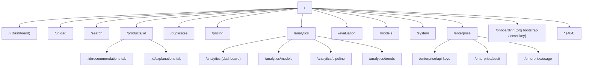
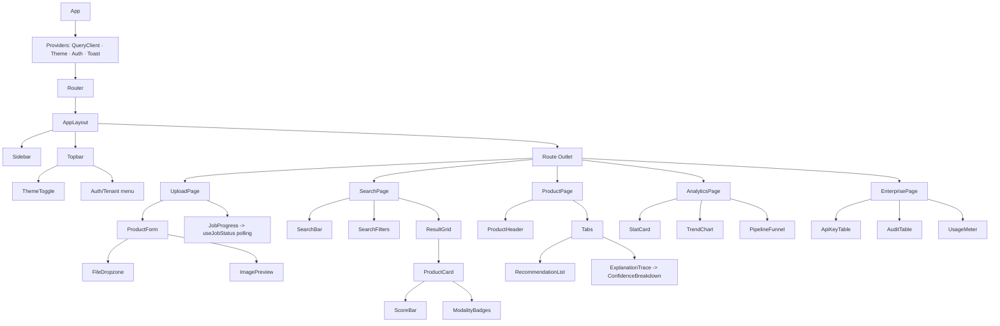
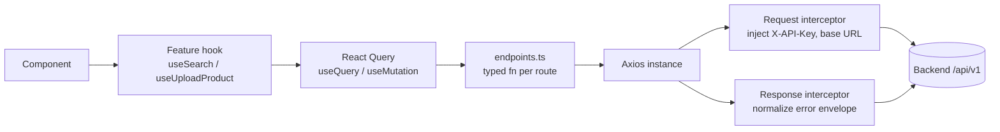
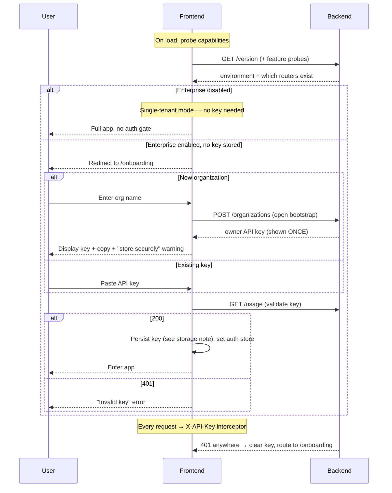
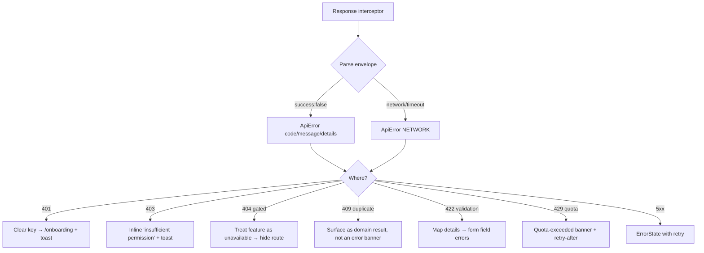

# Frontend Architecture

> **Stage 2 deliverable — design only, no application code.**
> This document specifies the complete frontend architecture for the Multi-Modal Product
> Intelligence Engine. It is derived directly from the existing, production-ready backend
> API (see [`../backend/ARCHITECTURE.md`](../backend/ARCHITECTURE.md)). **The backend must
> not be modified.** Every page, request, and response type below maps to an endpoint that
> already exists.

---

## Table of contents

1. [Backend contract summary](#1-backend-contract-summary)
2. [Technology decisions](#2-technology-decisions)
3. [Folder structure](#3-folder-structure)
4. [Route structure](#4-route-structure)
5. [Component hierarchy](#5-component-hierarchy)
6. [API client architecture](#6-api-client-architecture)
7. [Authentication flow](#7-authentication-flow)
8. [State management](#8-state-management)
9. [Error handling](#9-error-handling)
10. [Loading strategy](#10-loading-strategy)
11. [Theme system](#11-theme-system)
12. [API-to-page mapping](#12-api-to-page-mapping)
13. [Wireframes](#13-wireframes)
14. [Responsive strategy](#14-responsive-strategy)
15. [Accessibility plan](#15-accessibility-plan)
16. [Design system](#16-design-system)
17. [Open decisions](#17-open-decisions)

---

## 1. Backend contract summary

The frontend consumes exactly the following surface. Nothing here is invented — each row is
an existing route.

| Domain | Method & path (under `/api/v1`) | Request | Response |
|---|---|---|---|
| Upload | `POST /products/upload` | `multipart/form-data`: `name`, `file`, `brand?`, `description?`, `category?`, `price?` | `202` `UploadAcceptedResponse` (async) **or** `201` `UploadResponse` (sync) |
| Job status | `GET /products/{id}/status` | — | `JobStatusResponse` (`status`, `progress`, `current_stage`, `retry_count`, …) |
| Search | `POST /products/search` | `multipart/form-data`: `file?`, `query?` (≥1 required), `top_k`, `brand?`, `category?`, `min_price?`, `max_price?` | `ProductSearchResponse` (`results[]`: `product_id`, `score`, `matched_modalities`, `metadata`) |
| Recommendations | `GET /products/{id}/recommendations` | — | `RecommendationsResponse` (`recommendation_type`, `recommendations[]`) |
| Duplicate check | `POST /products/check-duplicate` | `multipart/form-data` (like upload) | `DuplicateCheckResponse` (`duplicate`, `confidence`, `signals`, `top_candidates[]`, `cross_encoder_score?`, `reasons[]`) |
| Pricing | `POST /pricing/estimate` | JSON `PricingRequest` (`name`, `brand?`, `category?`, `description?`, `top_k?`) | `PricingResponse` (`estimated_price`, `confidence`, `strategy`, `comparables[]`, …) |
| Pricing (by id) | `GET /pricing/{product_id}` | — | `PricingResponse` |
| Explanations | `GET /recommendations/{id}/trace` · `/duplicates/{id}/trace` · `/products/{id}/explanations` | — | `TraceBundleResponse` / `ProductExplanationsResponse` |
| Jobs | `GET /jobs/{id}` · `GET /jobs/dead-letter` | — | `JobStatusResponse` / list |
| Evaluation | `POST /evaluation/run` · `POST /evaluation/compare-reranking` | JSON | `EvaluationRunResponse` / `RerankComparisonResponse` |
| Models | `GET /models` · `/models/{type}` · `/models/{type}/active` | — | `ModelInfoResponse`(s) |
| Analytics | `GET /analytics/dashboard` · `/models` · `/pipeline` · `/trends` | — | `DashboardResponse`, `ModelAnalyticsResponse`, `AnalyticsReportResponse`, `TrendReportResponse` |
| Enterprise | `POST/GET /organizations` · `POST/GET /api-keys` · `DELETE /api-keys/{prefix}` · `GET /audit` · `GET /usage` | JSON | `OrganizationBootstrapResponse`, `ApiKeyInfo[]`, `AuditEventInfo[]`, `UsageResponse`, … |
| Ops | `GET /system/health` · `/system/stats` · `/health` · `/ready` · `/version` | — | `SystemHealthResponse`, `SystemStatsResponse`, … |
| Metrics | `GET /metrics` | — | Prometheus text exposition (not a UI data source; see §12) |

**Cross-cutting contract facts the frontend must honor:**

- **Error envelope (uniform):** every error returns `{"success": false, "error": {"code", "message", "details"}}`. The API client parses this shape centrally.
- **Auth:** when the enterprise layer is enabled, requests carry an **API key** in the `X-API-Key` header (header name is backend-configurable). There is **no** JWT, cookie, or password login. `POST /organizations` is the single unauthenticated bootstrap endpoint; it returns the owner key **once**.
- **Feature flags:** pricing, analytics, enterprise, evaluation, and the system endpoints are each **gated** server-side. The UI must degrade gracefully (hide/disable) when a route returns `404`/is unavailable.
- **Async uploads:** upload returns `202` with a `status_url`; the UI **polls** `GET /products/{id}/status` until `completed`/`failed`.
- **Multipart forms:** upload, search, and duplicate-check are `multipart/form-data`, not JSON.

---

## 2. Technology decisions

> These are the recommended foundation. They are consequential; see [§17](#17-open-decisions) for the veto points. Everything downstream assumes this stack.

| Concern | Choice | Why |
|---|---|---|
| Framework | **React 18 + TypeScript** | Ubiquitous, strongly typed against the API contract, best hiring signal |
| Build tool | **Vite** | Fast dev server/HMR, first-class TS, simple static build for later Docker/CDN hosting |
| Routing | **React Router v6** | Mature nested routing + data APIs; SPA fits an API-key/token model well |
| Server state | **TanStack Query (React Query)** | Caching, polling (job status), retries, background refetch — ideal for this API |
| Client/UI state | **Zustand** | Minimal global store for auth/theme/UI; avoids Redux boilerplate |
| Styling | **Tailwind CSS** | Fast, consistent, themable via CSS variables |
| Component primitives | **shadcn/ui (Radix UI)** | Accessible, unstyled primitives we own and theme; strong a11y baseline |
| Forms | **React Hook Form + Zod** | Typed validation mirroring backend field constraints |
| HTTP | **Axios** (single typed instance) | Interceptors for auth header + error normalization |
| Charts | **Recharts** | Analytics dashboards and trend lines |
| Icons | **lucide-react** | Matches shadcn conventions |
| Testing | **Vitest + React Testing Library + MSW** | Unit/integration with mocked API; **Playwright** for E2E |
| Quality | **ESLint + Prettier + tsc** | Mirrors the backend's ruff/black/mypy discipline |

> [!NOTE]
> This is a **SPA** (not SSR/Next.js). The backend is a separate API service and auth is
> API-key based, so server rendering adds cost without benefit here. The build output is
> static assets, which slots cleanly into the planned Docker/CDN deployment (Stage 8–12).

---

## 3. Folder structure

Feature-first organization: shared primitives at the root, each business domain isolated in
`features/` so it can grow without cross-talk (mirrors the backend's service boundaries).

```
frontend/
├── public/                      # static assets, favicon
├── src/
│   ├── app/                     # app shell
│   │   ├── App.tsx              # providers + router outlet
│   │   ├── router.tsx           # route tree (see §4)
│   │   ├── providers.tsx        # QueryClient, Theme, Auth, Toast providers
│   │   └── layouts/             # AppLayout (sidebar+topbar), AuthLayout, ErrorLayout
│   ├── lib/
│   │   ├── api/
│   │   │   ├── client.ts        # Axios instance + interceptors
│   │   │   ├── endpoints.ts     # typed endpoint fns (one per backend route)
│   │   │   ├── types.ts         # TS types mirroring backend schemas
│   │   │   ├── errors.ts        # ApiError, error-envelope parsing
│   │   │   └── queryKeys.ts     # centralized React Query keys
│   │   ├── auth/                # api-key storage, auth store bindings
│   │   ├── theme/               # theme provider, tokens, useTheme
│   │   ├── format/              # currency, dates, numbers, percentages
│   │   └── utils/               # cn(), file helpers, polling helper
│   ├── components/
│   │   ├── ui/                  # shadcn primitives (Button, Card, Dialog, …)
│   │   ├── common/              # AppShell, Sidebar, Topbar, PageHeader
│   │   ├── feedback/            # Spinner, Skeleton, EmptyState, ErrorState, Toast
│   │   ├── data/                # DataTable, StatCard, ScoreBar, ConfidenceBadge
│   │   └── forms/               # FileDropzone, ImagePreview, FormField wrappers
│   ├── features/
│   │   ├── upload/              # components + hooks (useUploadProduct, useJobStatus)
│   │   ├── search/              # useSearch, filters, result grid
│   │   ├── product/            # product detail, recommendations, explanations
│   │   ├── duplicates/          # duplicate-check form + signal breakdown
│   │   ├── pricing/             # pricing form + comparables table
│   │   ├── analytics/           # dashboard, models, pipeline, trends
│   │   ├── evaluation/          # run + rerank comparison
│   │   ├── models/              # model registry views
│   │   ├── enterprise/          # org bootstrap, api keys, audit, usage
│   │   └── system/              # health/stats operational panel
│   ├── pages/                   # thin route components composing feature modules
│   ├── stores/                  # zustand stores (auth, ui, theme)
│   ├── hooks/                   # cross-feature hooks (useMediaQuery, useDebounce)
│   ├── config/                  # env, feature-flag detection, constants
│   ├── styles/                  # tailwind base, css variables (tokens)
│   └── main.tsx                 # entrypoint
├── tests/                       # setup, msw handlers, e2e
├── .env.example                 # VITE_API_BASE_URL, VITE_API_KEY_HEADER
├── index.html
├── tailwind.config.ts
├── tsconfig.json
├── vite.config.ts
└── package.json
```

---

## 4. Route structure



| Route | Page | Gated by | Notes |
|---|---|---|---|
| `/` | Dashboard | — (analytics optional) | KPIs from analytics + system health; falls back gracefully |
| `/upload` | Upload | — | Multipart upload + live job progress |
| `/search` | Search | — | Image/text/hybrid search + filters |
| `/products/:id` | Product detail | — | Status, recommendations, explanations tabs |
| `/duplicates` | Duplicate check | — | Ad-hoc verification with signal breakdown |
| `/pricing` | Pricing | `PRICING__ENABLED` | Estimate form + comparables |
| `/analytics/*` | Analytics | `ANALYTICS__ENABLED` | Dashboard, models, pipeline, trends |
| `/evaluation` | Evaluation | `EVALUATION__ENABLED` | Run + reranking comparison |
| `/models` | Model registry | — | Active/registered models |
| `/system` | System panel | `METRICS__HEALTH_ENDPOINTS_ENABLED` | Health/stats operational view |
| `/enterprise/*` | Enterprise admin | `ENTERPRISE__ENABLED` + auth | API keys, audit, usage |
| `/onboarding` | Onboarding | — | Bootstrap org / paste API key |
| `*` | NotFound | — | 404 |

Gated routes are wrapped in a `<FeatureGate flag="...">` guard that resolves availability
from a capabilities probe (see [§7](#7-authentication-flow) / [§12](#12-api-to-page-mapping)).

---

## 5. Component hierarchy



**Reusable presentational components** (feature-agnostic): `StatCard`, `ScoreBar`,
`ConfidenceBadge`, `SignalBreakdown`, `DataTable`, `EmptyState`, `ErrorState`, `Skeleton`,
`FileDropzone`, `PageHeader`. Feature modules compose these; pages compose feature modules.

---

## 6. API client architecture

A single typed layer; components never call `fetch`/`axios` directly — they use hooks that
wrap endpoint functions.



**Layers**

1. **`client.ts`** — one Axios instance. Base URL from `VITE_API_BASE_URL`. Request
   interceptor injects the API key header (name from `VITE_API_KEY_HEADER`, default
   `X-API-Key`) when a key is present. Response interceptor unwraps the error envelope into
   a typed `ApiError`.
2. **`types.ts`** — hand-written TS interfaces mirroring backend schemas (source of truth is
   the backend; optionally generated from the live OpenAPI at `/openapi.json` in CI later).
3. **`endpoints.ts`** — one function per route, e.g. `searchProducts(params)`,
   `getJobStatus(id)`, `estimatePrice(body)`, `listApiKeys()`. Handles multipart vs JSON.
4. **Feature hooks** — thin wrappers over `useQuery`/`useMutation` with centralized
   `queryKeys`. Polling, invalidation, and optimistic updates live here.

**Query-key conventions** (`queryKeys.ts`): `['products','status',id]`,
`['search',params]`, `['analytics','dashboard']`, `['enterprise','apiKeys']`, etc. — so
mutations can precisely invalidate.

---

## 7. Authentication flow

The backend uses **API-key auth** (no passwords/JWT). The UI reflects this exactly.



**Key storage decision:** store the API key in **memory (Zustand) + `sessionStorage`** by
default, with an explicit opt-in "remember on this device" that moves it to
`localStorage`. Rationale: an API key is a long-lived bearer credential; defaulting to
session scope limits exposure. The one-time owner key from bootstrap is shown with a copy
button and a clear warning that it cannot be retrieved again. Keys are never logged and
never placed in the URL.

**RBAC in the UI:** the stored key's role (`owner`/`admin`/`member`/`viewer`) — obtained
from the created key or an org lookup — drives conditional rendering. Management actions
(create/revoke keys, view audit) are hidden/disabled for insufficient roles, but the UI
treats server `403` as the source of truth (client checks are UX only, never the gate).

---

## 8. State management

| State kind | Tool | Examples |
|---|---|---|
| **Server state** | TanStack Query | search results, job status, analytics, models, api keys, usage, audit |
| **Auth state** | Zustand (`authStore`) | api key, role, tenant/org id, `isAuthenticated` |
| **UI state** | Zustand (`uiStore`) | sidebar open, active modals, global toasts |
| **Theme state** | Zustand (`themeStore`) + CSS vars | light/dark/system |
| **Form state** | React Hook Form | upload, search filters, pricing, api-key creation |
| **URL state** | React Router params/search | search query & filters, analytics window, pagination |

Principles: **server data is never copied into Zustand** (Query owns it, single source of
truth); filters live in the **URL** so views are shareable/back-button-friendly; global
stores hold only cross-cutting client concerns.

---

## 9. Error handling



- **Central normalization**: the interceptor converts everything to `ApiError` so features
  handle a single shape.
- **Boundaries**: a top-level `RouteErrorBoundary` catches render/loader errors; each async
  view renders `<ErrorState onRetry>` from Query's `error`/`refetch`.
- **Validation mapping**: `422` `error.details` are mapped onto React Hook Form fields
  (mirroring backend constraints like `name` 1–200 chars, `price ≥ 0`).
- **Domain "errors" that aren't failures**: a `409` on block-mode upload and a positive
  duplicate result are rendered as **informative outcomes**, not red error banners.
- **Toasts** for transient issues; **inline** for field/section-level issues; **full-page**
  only for route-level fatal errors.

---

## 10. Loading strategy

| Scenario | Pattern |
|---|---|
| Initial page data | **Skeleton** components matching final layout (no spinners-of-doom) |
| Lists/tables/grids | Skeleton rows/cards; `EmptyState` when zero results |
| Mutations (upload, search submit, key create) | Button pending state + disabled form |
| **Async upload processing** | `useJobStatus` polls `GET /products/{id}/status` at ~1.5s interval with backoff, shows a **stepper** (Validating → Processing → Generating recommendations → Completed), stops on terminal state |
| Background freshness | React Query `staleTime` per domain; silent background refetch |
| Heavy AI actions (evaluation run) | Long-running progress affordance + optimistic "queued" feedback |
| Route transitions | Prefetch on hover/intent where cheap; suspense-style fallback per route |

Global config: retry idempotent GETs (2×, exponential); **never** auto-retry non-idempotent
mutations; `refetchOnWindowFocus` on for dashboards, off for one-shot results.

---

## 11. Theme system

- **Tokens as CSS variables** in `styles/` (`--color-bg`, `--color-fg`, `--color-primary`,
  `--color-muted`, `--radius`, spacing/typography scales). Tailwind maps to these variables
  so one token set drives everything.
- **Modes**: `light`, `dark`, and `system` (via `prefers-color-scheme`). The active mode
  stamps `data-theme` on `<html>`; a toggle in the topbar persists the choice
  (`themeStore` + `localStorage`), with no flash-of-wrong-theme (inline pre-hydration
  script sets the attribute before paint).
- **Semantic colors** for AI signals: consistent scales for confidence
  (low/medium/high), similarity scores, and status (healthy/degraded/down) reused across
  duplicate, pricing, recommendation, and system views.
- **Brand-neutral** default palette; a single token change re-skins the app.

---

## 12. API-to-page mapping

| Page | Reads | Writes | Feature flag |
|---|---|---|---|
| **Dashboard** | `GET /analytics/dashboard`, `GET /system/health`, `GET /version` | — | analytics/system optional |
| **Upload** | `GET /products/{id}/status` (poll) | `POST /products/upload` | — |
| **Search** | — | `POST /products/search` | — |
| **Product detail** | `GET /products/{id}/status`, `GET /products/{id}/recommendations`, `GET /products/{id}/explanations` | — | — |
| **Duplicates** | — | `POST /products/check-duplicate` | — |
| **Pricing** | `GET /pricing/{product_id}` | `POST /pricing/estimate` | `PRICING__ENABLED` |
| **Analytics · Overview** | `GET /analytics/dashboard` | — | `ANALYTICS__ENABLED` |
| **Analytics · Models** | `GET /analytics/models`, `GET /models` | — | analytics |
| **Analytics · Pipeline** | `GET /analytics/pipeline` | — | analytics |
| **Analytics · Trends** | `GET /analytics/trends` | — | analytics |
| **Evaluation** | — | `POST /evaluation/run`, `POST /evaluation/compare-reranking` | `EVALUATION__ENABLED` |
| **Models** | `GET /models`, `/models/{type}`, `/models/{type}/active` | — | — |
| **System** | `GET /system/health`, `GET /system/stats` | — | `METRICS__HEALTH_ENDPOINTS_ENABLED` |
| **Onboarding** | `GET /usage` (validate) | `POST /organizations` | enterprise |
| **Enterprise · API keys** | `GET /api-keys` | `POST /api-keys`, `DELETE /api-keys/{prefix}` | `ENTERPRISE__ENABLED` |
| **Enterprise · Audit** | `GET /audit` | — | enterprise |
| **Enterprise · Usage** | `GET /usage` | — | enterprise |

> **`GET /metrics`** is Prometheus exposition, **not** a UI data source. The UI uses the
> JSON `system`/`analytics` endpoints for operational visuals and links out to Grafana/
> Prometheus for raw metrics. **Feature availability** is detected by probing each optional
> router once at startup (success vs. `404`) and caching the capability map; gated nav
> items and routes render only when available.

---

## 13. Wireframes

**App shell (desktop)**

```
┌───────────────────────────────────────────────────────────────┐
│  ▤ Product Intelligence      🔍 quick search        ☾  ⚙  tenant│
├──────────┬────────────────────────────────────────────────────┤
│ Dashboard│                                                     │
│ Upload   │   PAGE CONTENT (route outlet)                       │
│ Search   │                                                     │
│ Products │                                                     │
│ Duplicates                                                     │
│ Pricing  │                                                     │
│ Analytics│                                                     │
│ Models   │                                                     │
│ System   │                                                     │
│ Enterprise                                                     │
└──────────┴────────────────────────────────────────────────────┘
```

**Upload + live progress**

```
┌ Upload product ──────────────────────────────────────────────┐
│  ┌───────────────┐   Name*      [___________________]         │
│  │  drop image   │   Brand      [___________________]         │
│  │   or browse   │   Category   [___________________]         │
│  │   [preview]   │   Price      [______]  Description [____]  │
│  └───────────────┘                          [ Upload ▸ ]      │
├───────────────────────────────────────────────────────────────┤
│  Processing job 7ab1…                                          │
│  ①Validating ─ ②Processing ─ ③Recommendations ─ ④Done          │
│  ▓▓▓▓▓▓▓▓▓▓░░░░░░  80%   stage: Generating recommendations     │
└───────────────────────────────────────────────────────────────┘
```

**Search results**

```
┌ Search ───────────────────────────────────────────────────────┐
│ [ text query ......... ] [＋image] top_k[10] brand[ ] cat[ ]   │
│ price [min]–[max]                                    [Search]   │
├───────────────────────────────────────────────────────────────┤
│ ┌──────┐ ┌──────┐ ┌──────┐ ┌──────┐                            │
│ │ img  │ │ img  │ │ img  │ │ img  │   each card:               │
│ │ name │ │ name │ │ name │ │ name │   score bar + [img][text] │
│ │ ▓0.83│ │ ▓0.79│ │ ▓0.74│ │ ▓0.71│   modality badges         │
│ └──────┘ └──────┘ └──────┘ └──────┘                            │
└───────────────────────────────────────────────────────────────┘
```

**Duplicate check — signal breakdown**

```
┌ Duplicate check ──────────────────────────────────────────────┐
│  [form like upload]                     [ Check ▸ ]            │
├───────────────────────────────────────────────────────────────┤
│  Verdict:  ● DUPLICATE   confidence 0.94                       │
│  Signals   image ▓▓▓▓▓ 0.9  text ▓▓▓ 0.6  meta ▓▓ 0.4 attr ▓▓ │
│  Cross-encoder 0.95 · reasons: same brand, title similarity   │
│  Top candidates                                     [table]   │
└───────────────────────────────────────────────────────────────┘
```

**Pricing**

```
┌ Pricing estimate ─────────────────────────────────────────────┐
│  name[ ] brand[ ] category[ ]                    [Estimate ▸]  │
├───────────────────────────────────────────────────────────────┤
│   Estimated  ₹1,899.50    confidence: MEDIUM (0.62)           │
│   strategy: trimmed_mean · from 12 comparables                │
│   Comparables  product · price · similarity          [table]  │
└───────────────────────────────────────────────────────────────┘
```

**Analytics dashboard**

```
┌ Analytics ────────────────────────────────────────────────────┐
│ [Overview] Models  Pipeline  Trends            window: 7d ▾    │
├───────────────────────────────────────────────────────────────┤
│  [Uploads 128] [Searches 540] [Dup checks 44] [Recs 310]       │
│  ┌ Trend (uploads) ─────────────┐  ┌ Pipeline funnel ───────┐ │
│  │      /\      /\               │  │ upload→embed→index→…    │ │
│  └──────────────────────────────┘  └────────────────────────┘ │
└───────────────────────────────────────────────────────────────┘
```

**Enterprise · API keys**

```
┌ Enterprise ▸ API keys ────────────────────────────────────────┐
│  [ + Create key ]                             role: owner ▾    │
│  name    role     prefix        created     revoked   actions  │
│  ci      member   pik_ab12…     2026-07-20  no        [revoke] │
│  admin   admin    pik_cd34…     2026-07-19  no        [revoke] │
└───────────────────────────────────────────────────────────────┘
```

**Onboarding (enterprise enabled)**

```
┌ Welcome ──────────────────────────────────────────────────────┐
│  ( ) Create a new organization   ( ) I already have a key      │
│  Org name [__________]                          [ Continue ▸ ] │
│  ── after bootstrap ──                                         │
│  Your owner key (shown once):  pik_xxxxxxxxxxxx   [copy]       │
│  ⚠ Store it securely — it cannot be shown again.               │
└───────────────────────────────────────────────────────────────┘
```

---

## 14. Responsive strategy

- **Mobile-first**, Tailwind breakpoints `sm 640 / md 768 / lg 1024 / xl 1280`.
- **Sidebar**: persistent rail ≥`lg`; collapses to a hamburger **Sheet** drawer below.
- **Grids**: search/recommendation cards `1 → 2 → 3 → 4` columns across breakpoints.
- **Tables**: horizontal scroll containers on small screens; key columns promoted, others
  behind a details expander (audit, comparables, api keys).
- **Charts**: `ResponsiveContainer`; simplify axes/legends on narrow viewports.
- **Forms**: two-column (image + fields) on `md+`, single column stacked on mobile.
- **Touch targets** ≥44px; drag-drop upload has an explicit "browse" fallback for touch.

---

## 15. Accessibility plan

Target **WCAG 2.1 AA**.

- **Primitives**: shadcn/Radix give focus management, roving tabindex, and ARIA for
  dialogs, menus, tabs, tooltips out of the box.
- **Keyboard**: every interactive element reachable/operable; visible focus rings; logical
  tab order; `Esc` closes overlays; skip-to-content link.
- **Screen readers**: semantic landmarks (`header`/`nav`/`main`), labelled form controls,
  `aria-live` regions for job-progress updates, toasts, and async result counts.
- **Color**: never encode meaning by color alone — confidence/similarity/status also carry
  text/icon; verify contrast ≥4.5:1 in both themes.
- **Media**: `alt` text on product images (name/brand); decorative icons `aria-hidden`.
- **Motion**: honor `prefers-reduced-motion` (disable non-essential transitions).
- **Forms**: programmatic error association (`aria-describedby`), inline validation text,
  no timeout-only feedback.
- **Testing**: `eslint-plugin-jsx-a11y`, axe checks in component tests, manual keyboard/SR
  passes on core flows (upload, search, onboarding).

---

## 16. Design system

- **Foundations**: type scale, spacing scale (4px base), radius, elevation, and the color
  tokens from [§11]; all expressed as CSS variables consumed by Tailwind.
- **Primitives (ui/)**: Button, Input, Select, Textarea, Checkbox/Radio, Dialog, Sheet,
  Tabs, Tooltip, Badge, Card, Table, Toast, Skeleton, Progress, DropdownMenu — from
  shadcn/ui, owned in-repo and themed.
- **Domain components (data/)**: `StatCard`, `ScoreBar` (similarity), `ConfidenceBadge`
  (low/med/high), `SignalBreakdown` (duplicate signals), `ModalityBadges`
  (image/text), `JobProgressStepper`, `UsageMeter`, `HealthPill`.
- **Patterns**: `PageHeader` (title + actions + breadcrumbs), `EmptyState`, `ErrorState`,
  `FeatureGate`, `ConfirmDialog` (revoke key), `CopyableSecret` (one-time key).
- **Documentation**: components catalogued (Storybook recommended) with a11y and usage
  notes; naming and prop conventions mirror the backend's clarity discipline.
- **Consistency rules**: one currency/number/date formatter set (`lib/format`), one toast
  system, one confirmation pattern for destructive actions.

---

## 17. Confirmed decisions

The foundational forks have been decided and are now locked for Stage 3:

| Decision | Choice | Status |
|---|---|---|
| **Framework / build** | React + TypeScript + Vite (SPA, React Router) | ✅ Confirmed |
| **Styling / design system** | Tailwind CSS + shadcn/ui (Radix) | ✅ Confirmed |
| **Server / client state** | TanStack Query + Zustand | ✅ Confirmed |
| **Primary demo persona** | **Single-tenant, no auth gate** — app opens to Dashboard/Upload; enterprise onboarding + RBAC are optional and only surface when `ENTERPRISE__ENABLED` | ✅ Confirmed |

**Persona implication (single-tenant default):** the default landing is the **Dashboard**,
and the full app is reachable without an auth gate. The onboarding flow, API-key handling,
and enterprise admin pages in this document remain fully specified but are **conditionally
mounted** — they activate only when the backend reports the enterprise layer is enabled.
This keeps the first-run demo friction-free while preserving the multi-tenant capability.

**Still open (minor, non-blocking):**

- **API types** — hand-written now vs. generated from the backend's `/openapi.json`. Default:
  hand-written for Stage 3, with OpenAPI generation as a later hardening step.

> With the above confirmed, **Stage 3 — Frontend Foundation** scaffolds the project
> (tooling, app shell, API client, auth store, theme, base components) against this design.
